# Stage 1: Mining + Prediction — Summary Report

## 1. Introduction & Objectives

This report presents the results of **Stage 1: Mining + Prediction** for the EV Charging Behavior Analysis project. The goal is to extract temporal and behavioral patterns from electric vehicle (EV) charging session records, integrate them with local weather data, and build predictive models.

**Techniques employed:**
- Exploratory Data Analysis (EDA)
- K-Means & DBSCAN Clustering
- Apriori Association Rule Mining
- XGBoost & Random Forest Regression
- LSTM Time-Series Forecasting (PyTorch)

---

## 2. Dataset Overview

| Property | Caltech | JPL | Combined |
|---|---|---|---|
| Sessions | 14,099 | 13,446 | **27,389** (after cleaning) |
| Date Range | Apr – Nov 2018 | Sep 2018 – Jul 2019 | Apr 2018 – Jul 2019 |
| Unique Stations | 54 | 52 | 106 |
| Unique Users | 175 | 313 | 488 |
| Avg kWh Delivered | 8.97 | 13.63 | 11.2 |

**Climate data:** Hourly aggregated observations from 4 Los Angeles weather stations (Burbank, Downtown, El Monte, Whiteman) covering 2018–2019, providing 8 weather measurements (temperature, dew point, pressure, wind speed, precipitation, humidity, visibility, snow depth).

**Engineered features (47 total):** Session duration, charging duration, idle duration, charging rate (kW), utilization ratio, connection hour, day of week, is_weekend, month, week of year, time-of-day period, energy bin, duration bin, plus user input fields (kWhRequested, milesRequested, minutesAvailable, WhPerMile) and all climate means.

---

## 3. Exploratory Data Analysis

### 3.1 Feature Distributions

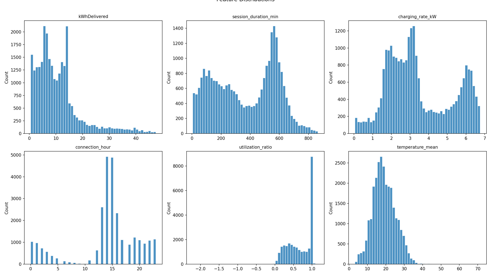

**Key observations:**
- **kWhDelivered** is right-skewed with a peak around 5–10 kWh; most sessions deliver moderate energy.
- **Session duration** shows a bimodal pattern — short visits (<2 hrs) and long workplace stays (8–10 hrs).
- **Charging rate** concentrates around 2–5 kW, consistent with Level 2 (240V) chargers.
- **Connection hour** reveals strong peaks at 7–9 AM (arrival) and a secondary peak around 2–4 PM.
- **Temperature** spans roughly 8–35°C across the LA region.

### 3.2 Temporal Patterns

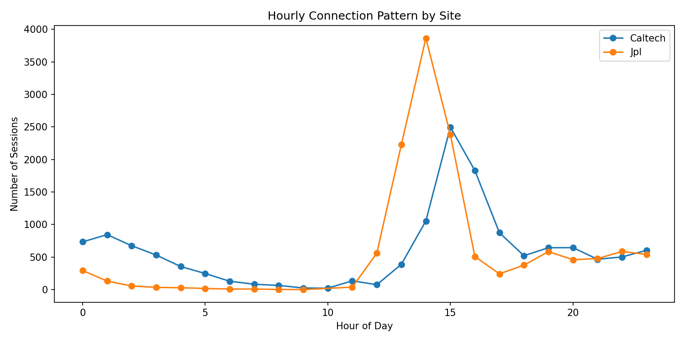

- Both sites show a dominant **morning peak (7–9 AM)**, confirming workplace charging behavior.
- JPL has a sharper single morning peak; Caltech shows a broader distribution with afternoon activity.
- Very few sessions start between midnight and 5 AM.

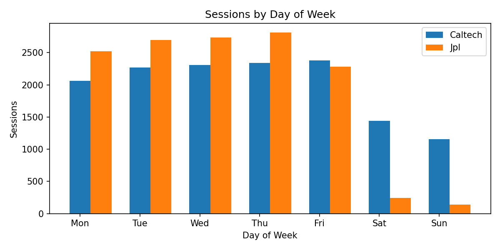

- Charging is overwhelmingly a **weekday activity** — Monday through Friday dominate.
- Weekend sessions are minimal, confirming these are workplace charging facilities.

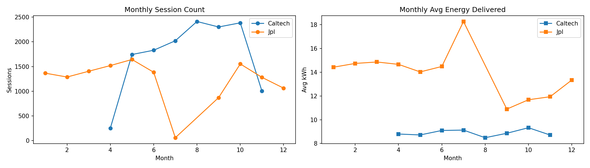

- Session counts vary by month due to the different operational periods of each site.
- Average kWh per session is relatively stable across months, with slight increases during colder periods.

### 3.3 Weather Correlation

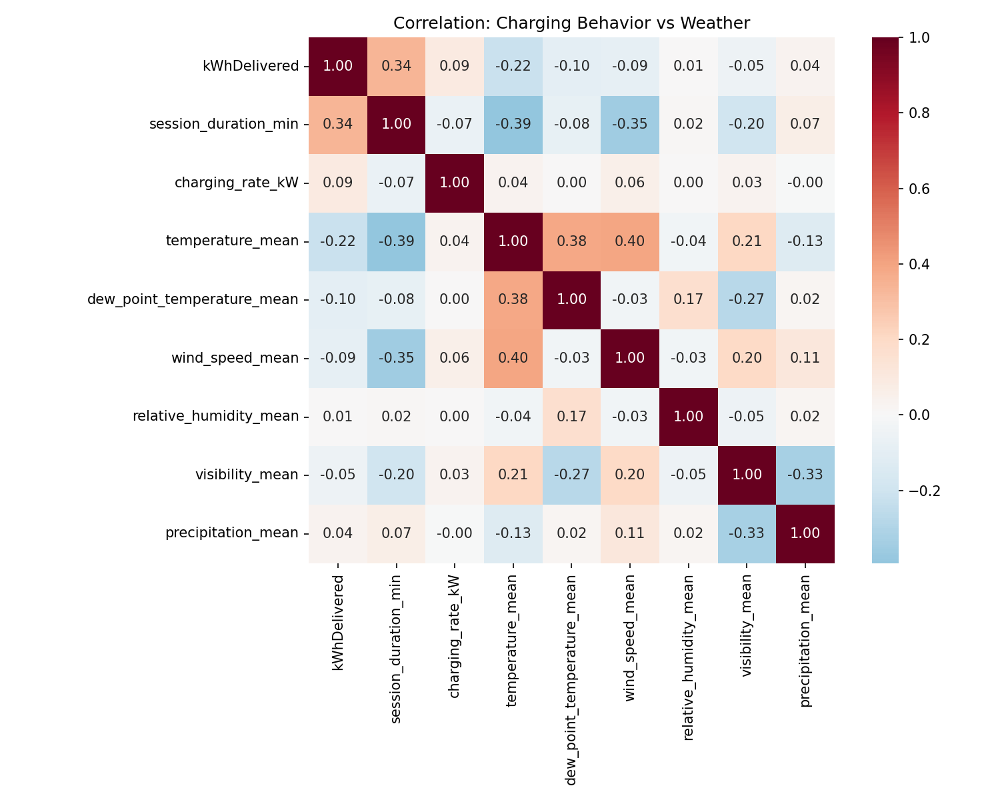

- **Session duration** and **kWhDelivered** are moderately correlated (r ≈ 0.45).
- Weather features show **weak direct correlation** with charging behavior — temperature, humidity, and wind speed have correlations near zero with kWh delivered.
- However, weather may interact non-linearly with temporal features, which the models capture.

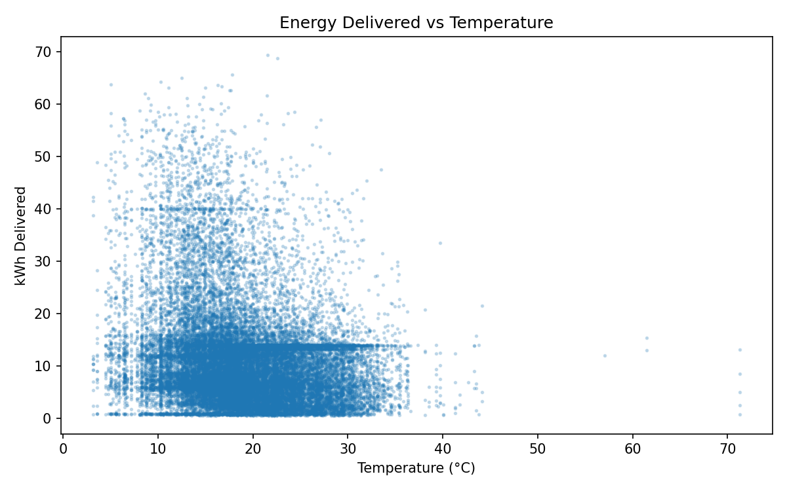

- No strong linear relationship between temperature and energy delivered, but the scatter reveals that extreme temperatures have slightly different usage patterns.

### 3.4 Weekend vs Weekday

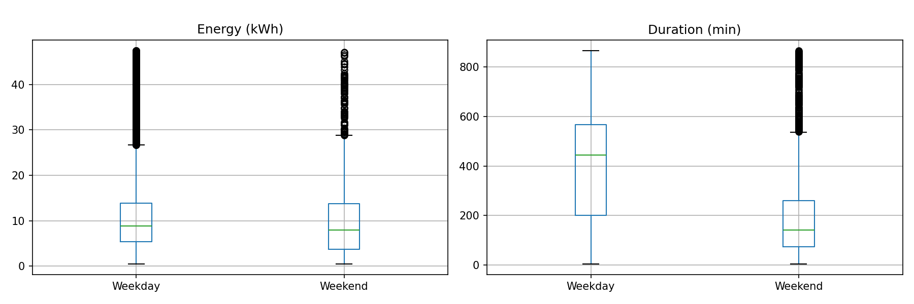

- Weekday sessions tend to have **longer durations** (workplace stays) but similar energy delivery.
- Weekend sessions are shorter and more variable.

---

## 4. Clustering Analysis

### 4.1 K-Means Clustering

**Feature set:** session_duration_min, kWhDelivered, charging_rate_kW, connection_hour, is_weekend, utilization_ratio

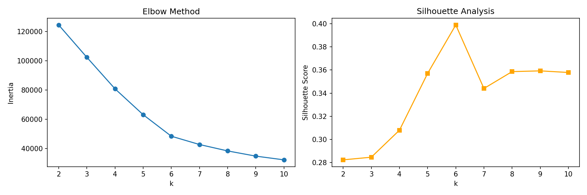

The optimal number of clusters was determined to be **k = 6** (silhouette score = 0.399).

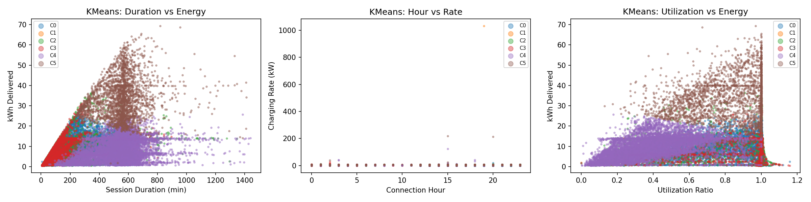

#### Cluster Profiles

| Cluster | Sessions | Avg Duration (min) | Avg kWh | Avg Rate (kW) | Hour | Weekend | Utilization | Interpretation |
|---|---|---|---|---|---|---|---|---|
| **C0** | 7,697 | 250 | 9.1 | 3.1 | 17.8 | 0% | 89% | **Evening quick-chargers** — weekday, high utilization |
| **C1** | 1 | 745 | 2.0 | 1033 | 19.0 | 0% | 0.02% | **Outlier** — anomalous single session |
| **C2** | 2,763 | 195 | 8.6 | 4.5 | 13.8 | 100% | 80% | **Weekend chargers** — shorter, efficient sessions |
| **C3** | 2,760 | 143 | 7.7 | 4.6 | 1.8 | 0% | 88% | **Late-night/early-morning** — short, efficient weekday |
| **C4** | 10,278 | 540 | 8.8 | 3.0 | 14.3 | 1% | 36% | **Workplace parkers** — long idle time, low utilization |
| **C5** | 2,591 | 551 | 33.9 | 5.0 | 14.2 | 4% | 82% | **Heavy chargers** — long sessions, high energy, high rate |

**Key insight:** The largest cluster (C4, 38% of sessions) represents the "park-and-forget" workplace pattern — users plug in during work hours but their cars finish charging well before they disconnect. Cluster C5 identifies heavy-duty EV users who require significantly more energy (~34 kWh vs ~9 kWh average).

### 4.2 DBSCAN Clustering

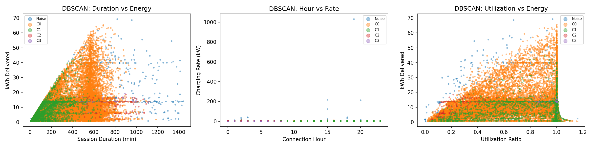

DBSCAN found **4 density-based clusters** with 289 noise points:
- **Cluster 0 (main):** Weekday workplace sessions with moderate duration/energy.
- **Clusters 1–3:** Weekend sub-groups with varying utilization patterns.
- **Noise (-1):** 289 outlier sessions with extreme durations or energy values.

---

## 5. Association Rule Mining

Using the Apriori algorithm on discretized features (min_support=0.05, min_lift=1.2), we extracted **7,068 association rules** from **1,014 frequent itemsets**.

### Top Rules by Lift

| # | Antecedent | Consequent | Support | Confidence | Lift |
|---|---|---|---|---|---|
| 1 | High utilization + Low energy | Short duration | 0.054 | 0.486 | **7.45** |
| 2 | Short duration | High utilization + Low energy | 0.054 | 0.824 | **7.45** |
| 3 | Evening time | Hot temp + Long duration + High wind | 0.054 | 0.353 | 3.91 |
| 4 | Short duration | Low energy | 0.058 | 0.883 | 3.71 |
| 5 | High util + Medium energy + High wind | Medium duration | 0.051 | 0.683 | 3.51 |
| 6 | Evening + Weekday | Hot temp + Long duration | 0.052 | 0.432 | 3.42 |
| 7 | Evening + Weekday | Long duration + High wind | 0.067 | 0.556 | 3.35 |

### Key Patterns Discovered

1. **Short sessions ↔ Low energy + High utilization** (lift 7.45): Users who need a quick top-up charge efficiently and leave promptly. This is the strongest behavioral pattern.
2. **Evening + Weekday → Long duration + Hot weather** (lift 3.4): Evening weekday connections tend to coincide with hot weather and longer parking durations — possibly users plugging in at end-of-day.
3. **Night sessions → Caltech + Weekday + High wind**: The Caltech site sees more late-night sessions, associated with windy conditions.
4. **High wind conditions** appear frequently in rules, suggesting wind patterns (e.g., Santa Ana winds) coincide with certain charging behaviors.

---

## 6. Prediction Models

### 6.1 Task A — Predict Energy Delivered (kWhDelivered)

**Features:** session_duration, charging_duration, connection_hour, day_of_week, is_weekend, month, temperature, dew_point, wind_speed, humidity, visibility

| Model | MAE | RMSE | R² | CV R² (5-fold) |
|---|---|---|---|---|
| XGBoost | 4.089 | 6.656 | 0.518 | 0.511 ± 0.007 |
| **Random Forest** | **4.037** | **6.547** | **0.534** | **0.522 ± 0.006** |

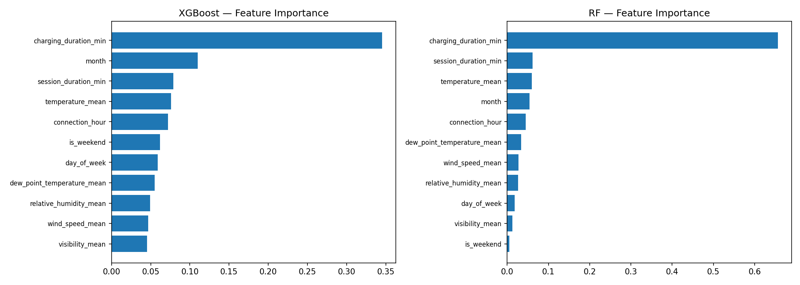

**Top predictors for kWh:** `charging_duration_min` and `session_duration_min` are the dominant features (as expected — longer sessions deliver more energy). Among non-trivial features, `connection_hour` and `month` contribute meaningfully, indicating temporal patterns affect energy needs.

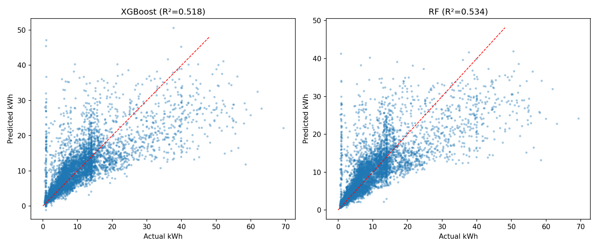

### 6.2 Task B — Predict Session Duration (temporal + weather only)

**Features:** connection_hour, day_of_week, is_weekend, month, temperature, dew_point, wind_speed, humidity, visibility, precipitation

| Model | MAE (min) | RMSE (min) | R² | CV R² (5-fold) |
|---|---|---|---|---|
| XGBoost | 129.7 | 181.2 | 0.338 | 0.339 ± 0.021 |
| **Random Forest** | **128.9** | **180.4** | **0.344** | **0.347 ± 0.019** |

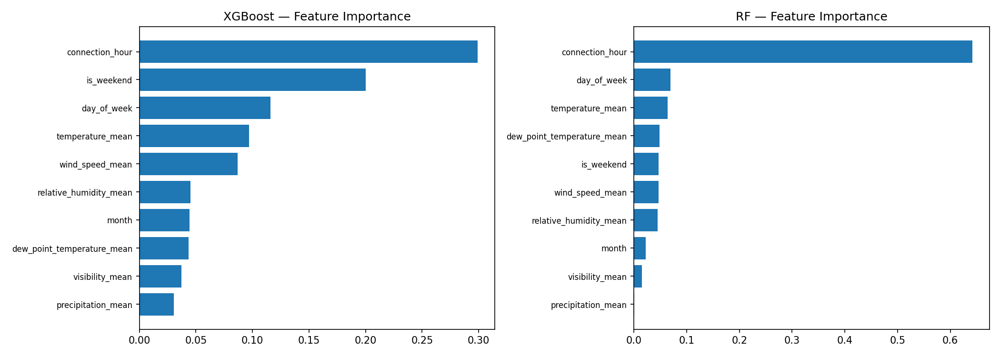

**Top predictors for duration:** `connection_hour` dominates — users who connect early morning park longer (full workday). `day_of_week` and `is_weekend` are also significant, confirming the weekday-workplace pattern.

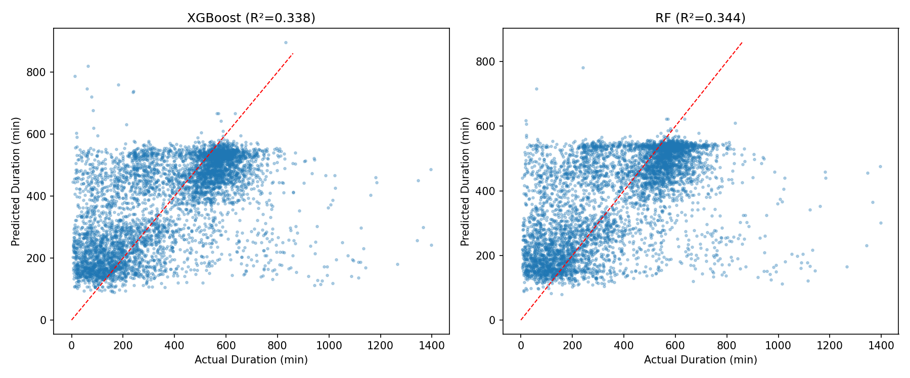

**Analysis:** Task B is inherently harder (R² ≈ 0.34) because session duration depends heavily on individual user behavior (when they choose to leave), which cannot be predicted from weather/time alone. However, the model still captures the broad pattern that morning arrivals stay longer than afternoon ones.

---

## 7. LSTM Time-Series Forecasting

A 2-layer LSTM network (PyTorch) was trained to predict **daily session counts** using a 14-day lookback window with 5 input features: session_count, total_kWh, avg_duration, avg_temperature, avg_humidity.

| Metric | Train | Test |
|---|---|---|
| MAE | 26.14 | 28.33 |
| RMSE | — | 30.64 |

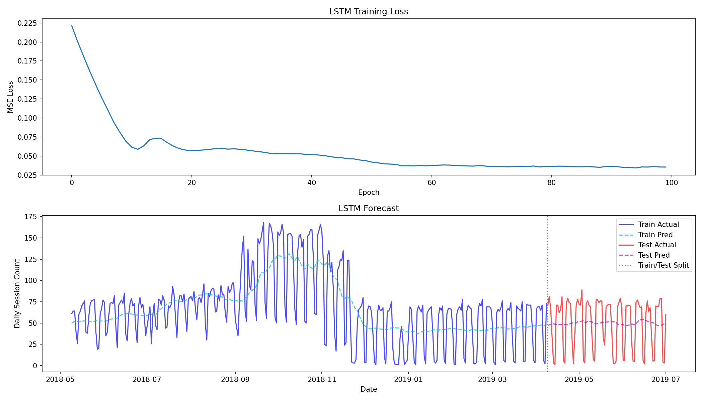

- The LSTM captures the **weekly cyclical pattern** (drops on weekends) and general trend.
- The model struggles with sudden demand spikes and the transition between sites' operational periods.
- Average daily sessions are ~64, so a test MAE of 28.33 represents approximately 44% mean error — the model captures the trend but not the volatility.

---

## 8. Summary of Findings

### Behavioral Patterns
1. **Workplace-dominated charging:** 95%+ of sessions occur on weekdays, with a sharp 7–9 AM arrival peak.
2. **Park-and-forget behavior:** The largest user cluster (38%) has very low utilization — cars finish charging hours before users disconnect.
3. **Two distinct user segments:** Quick top-up users (high utilization, <2.5 hrs) vs. all-day parkers (low utilization, 8–10 hrs).
4. **Heavy chargers:** ~10% of sessions consume 3–4× the average energy, forming a distinct behavioral cluster.

### Weather Influence
5. **Weak direct effect:** Weather features show minimal linear correlation with charging metrics.
6. **Indirect/interaction effects:** Association rules reveal that hot weather + high wind conditions associate with specific session patterns (evening connections, longer durations).
7. **Prediction contribution:** Weather features add modest predictive power (~2-3% R² improvement) when combined with temporal features.

### Predictive Capability
8. **Energy prediction:** Best R² = 0.534 (Random Forest) — session/charging duration are the strongest predictors.
9. **Duration prediction:** Best R² = 0.344 (Random Forest) — connection hour is the key predictor; individual behavior limits accuracy.
10. **Time-series:** LSTM captures weekly cycles but daily volatility remains challenging (MAE ≈ 28 sessions/day).

---

## 9. Files & Reproducibility

### Source Code
| File | Description |
|---|---|
| `stage1_main.py` | Main pipeline runner |
| `stage1_data_prep.py` | Data loading, merging, feature engineering |
| `stage1_eda.py` | Exploratory data analysis & visualizations |
| `stage1_clustering.py` | K-Means + DBSCAN clustering |
| `stage1_association.py` | Apriori association rule mining |
| `stage1_prediction.py` | XGBoost + Random Forest regression |
| `stage1_lstm.py` | PyTorch LSTM time-series forecasting |

### Output Files (`output/`)
- 7 EDA plots (`eda_*.png`)
- 3 Clustering plots + 2 profile CSVs
- 1 Association rules CSV (7,068 rules)
- 4 Prediction plots + 1 metrics CSV
- 1 LSTM forecast plot

### How to Run
```bash
python3 stage1_main.py
```
Total runtime: ~45 seconds. All outputs are saved to the `output/` directory.
