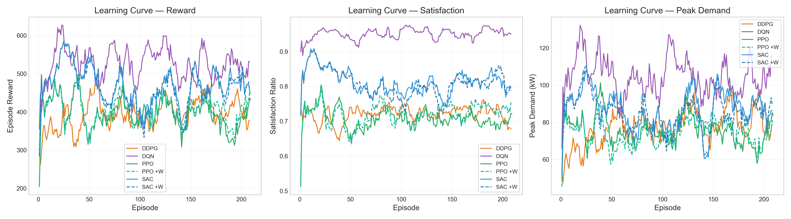
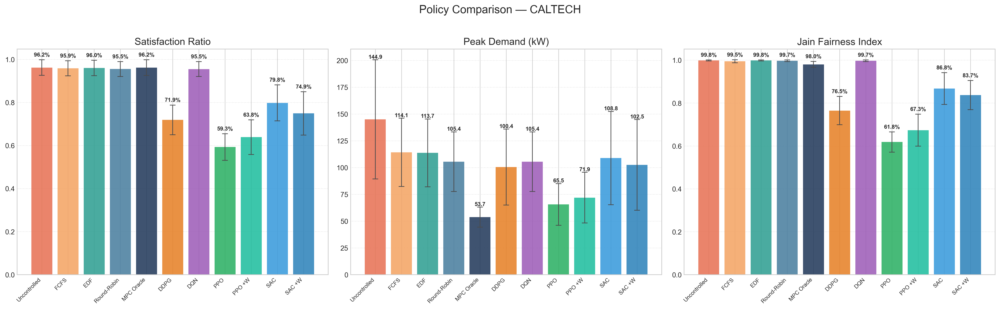
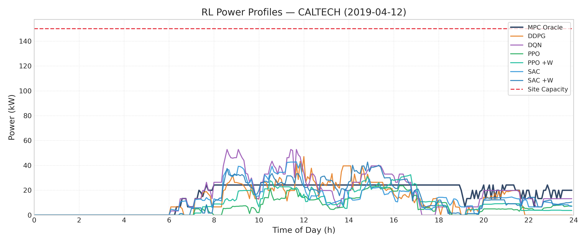
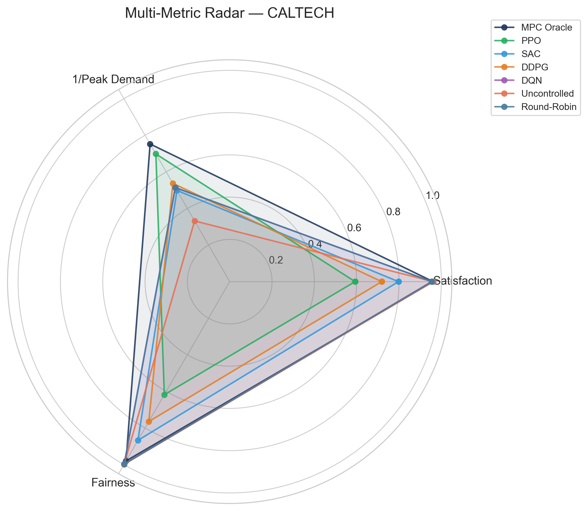
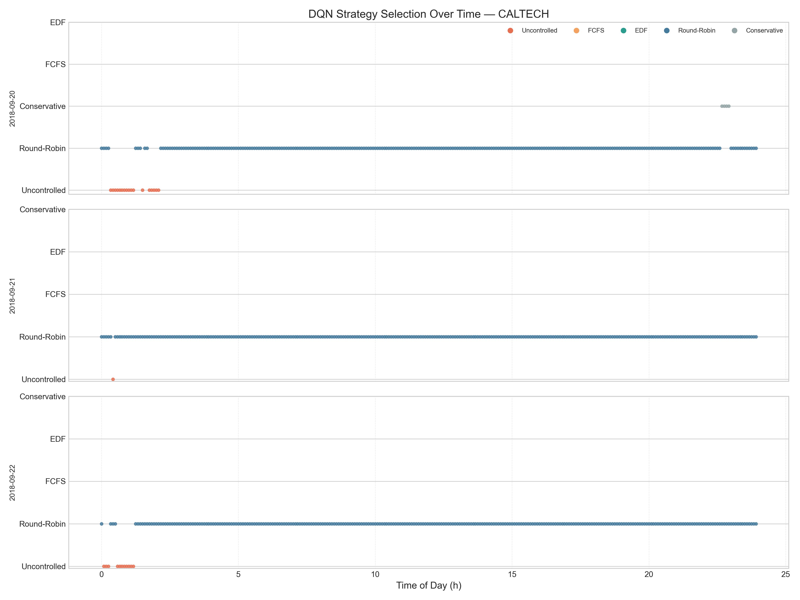
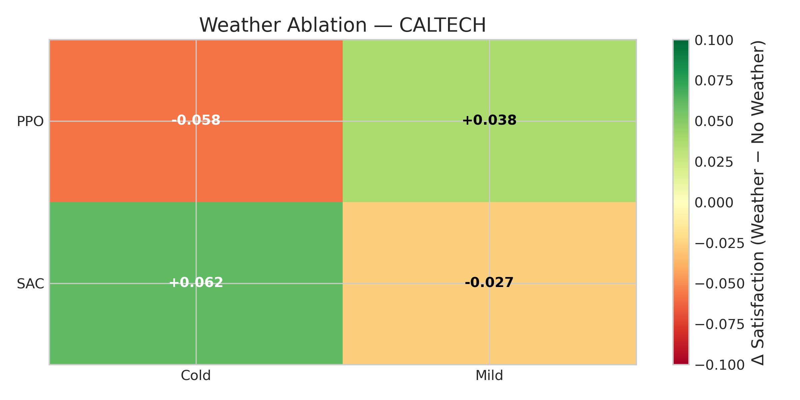

# Stage 2: Reinforcement Learning for EV Charging Scheduling — Detailed Code Report

**Course:** COMP4040 — Data Mining  
**Project:** EV Charging Behavior Analysis & Intelligent Scheduling  
**Stage:** 2 — From Heuristics to Intelligence  

---

## Table of Contents

1. [Executive Summary](#1-executive-summary)
2. [Problem Formulation](#2-problem-formulation)
3. [Dataset & Data Pipeline](#3-dataset--data-pipeline)
4. [Environment Design](#4-environment-design)
5. [Reward Function Design](#5-reward-function-design)
6. [RL Agent Implementations](#6-rl-agent-implementations)
7. [Baseline Policies](#7-baseline-policies)
8. [Experimental Setup & Results](#8-experimental-setup--results)
9. [Root-Cause Analysis: Why Deterministic Baselines Outperform RL](#9-root-cause-analysis-why-deterministic-baselines-outperform-rl)
10. [Weather Ablation Analysis](#10-weather-ablation-analysis)
11. [Potential Improvements & Future Work](#11-potential-improvements--future-work)
12. [Conclusions](#12-conclusions)
13. [Appendix: Source Code Reference](#13-appendix-source-code-reference)

---

## 1. Executive Summary

This report presents a comprehensive technical analysis of **Stage 2** of the EV Charging Behavior Analysis project, in which we formulate the Electric Vehicle (EV) charging scheduling problem as a Markov Decision Process (MDP) and attempt to solve it using four Reinforcement Learning (RL) algorithms: **DQN**, **PPO**, **DDPG**, and **SAC**. These learned policies are compared against four deterministic heuristic baselines (Uncontrolled, FCFS, EDF, Round-Robin) and an offline **MPC Oracle** upper bound that solves a Linear Program with perfect foresight. Experiments are conducted on **both** ACN-Data sites — **Caltech** (54 stations) and **JPL** (52 stations) — to assess cross-site generalizability.

**Key finding:** Deterministic heuristic baselines achieve **97–98% energy satisfaction** with near-perfect fairness (Jain index ≥ 0.993) at both sites, while continuous-action RL agents significantly underperform: at Caltech, **PPO reaches only 46.4%**, **SAC 78.1%**, and **DDPG 76.3%**; at JPL, the pattern repeats with **PPO at 46.4%**, **SAC 77.1%**, and **DDPG 56.4%**. The sole exception is **DQN**, which operates as a meta-learner selecting among heuristic baselines, achieving **97.1% at Caltech** and **98.0% at JPL**. Weather-augmented variants (PPO +W, SAC +W) provide marginal or no improvement at both sites. The consistency of these patterns across two distinct facility topologies and workload profiles confirms that the performance gap is **structural**, not site-specific.

This report provides:
- A detailed walkthrough of the Gymnasium environment wrapping ACN-Sim
- Complete documentation of the reward function, state space, and action space design
- Hyperparameter configurations and training infrastructure for all four RL algorithms
- Full experimental results with statistical analysis across 20 held-out test days at both Caltech and JPL
- **Five diagnosed root causes** explaining why deterministic baselines outperform learned policies, supported by code-level evidence, cross-site comparison, and RL literature context

---

## 2. Problem Formulation

### 2.1 The EV Charging Scheduling Problem

Electric vehicle charging at shared workplace facilities presents a constrained resource allocation problem. At any given time, multiple EVs may be connected to a charging network, each requesting a certain amount of energy before an (often uncertain) departure time. The charging infrastructure imposes physical constraints: transformer capacity limits, cable ampacity ratings, and per-station maximum pilot signals. The scheduling task is to determine the charging rate (in Amperes) for each station at each time step, subject to these constraints.

**Formally**, the problem can be stated as:

> **Given** a set of EVs arriving and departing throughout a 24-hour day, each with an energy demand and a deadline, and a charging network with physical capacity constraints, **determine** the charging rate for each station at each 5-minute interval to:
>
> 1. **Maximize** total energy delivered to all EVs (satisfaction)
> 2. **Minimize** peak aggregate power draw (demand charge reduction)
> 3. **Maximize** fairness across EVs (equitable service)

This is a **multi-objective, constrained, sequential decision-making problem** — a natural candidate for reinforcement learning.

### 2.2 Why Reinforcement Learning?

Several properties of the problem motivate an RL approach:

1. **Sequential nature**: Decisions at each time step affect future states. Charging an EV aggressively now may violate peak demand constraints later when more EVs arrive.

2. **Partial observability**: The agent observes only currently connected EVs; future arrivals are unknown. An RL agent could potentially learn temporal demand patterns from historical data.

3. **Adaptability**: Unlike fixed heuristics, RL agents can theoretically adapt their strategy based on the current system state, learning context-dependent policies (e.g., charge conservatively during peak hours, aggressively during off-peak).

4. **Multi-objective trade-offs**: The tension between energy delivery, peak shaving, and fairness requires nuanced decision-making that may benefit from learned optimization.

### 2.3 Connection to Stage 1 Findings

Stage 1 of this project established several behavioral patterns that inform the RL environment design:

- **Workplace-dominated charging**: 95%+ of sessions occur on weekdays with a sharp 7–9 AM arrival peak (justifying the 24-hour episode structure)
- **Park-and-forget behavior**: The largest user cluster (38% of sessions) has low utilization — cars finish charging hours before departure (suggesting that simple greedy policies may suffice for many sessions)
- **Weak weather correlation**: Weather features show near-zero linear correlation with charging metrics (r ≈ 0.0), questioning the value of weather-augmented observations
- **Bimodal session distribution**: Quick top-up users vs. all-day parkers create heterogeneous demand profiles

These findings foreshadow a key theme of this report: the specific characteristics of this workload make it **unusually amenable to simple heuristics** and **unusually challenging for RL**.

### 2.4 MDP Formulation

We formulate the EV charging scheduling problem as a Markov Decision Process (MDP):

| Component | Definition |
|---|---|
| **State** $s_t$ | A matrix $\mathbb{R}^{N \times 8}$ encoding per-station EV status, demand, laxity, and time encoding (see Section 4) |
| **Action** $a_t$ | A vector $[0, 1]^N$ of normalized charging rates for each of $N$ stations |
| **Transition** $T(s_{t+1} \mid s_t, a_t)$ | Governed by ACN-Sim physics: battery dynamics, EV arrivals/departures, network constraints |
| **Reward** $R(s_t, a_t)$ | Multi-objective signal combining energy delivery, peak penalty, and fairness (see Section 5) |
| **Episode** | One 24-hour day, discretized into 288 steps of 5-minute periods |
| **Discount** $\gamma$ | 0.99 |

Where $N$ is the number of charging stations (54 for Caltech, 52 for JPL).

---

## 3. Dataset & Data Pipeline

### 3.1 Data Sources

The project uses two primary data sources:

**1. ACN-Data EV Charging Sessions**

Charging session records from the Adaptive Charging Network (ACN) portal, covering two workplace charging facilities in the Los Angeles area:

| Property | Caltech | JPL |
|---|---|---|
| Total sessions | 23,000 | 13,446 |
| Date range | Apr – Nov 2018 | Sep 2018 – Jul 2019 |
| Unique stations | 54 | 52 |
| Unique users | 175 | 313 |
| Avg kWh delivered | 8.97 | 13.63 |
| Avg session duration | ~5.6 hrs | ~7.2 hrs |

Each session record contains:
- `connectionTime` / `disconnectTime`: UTC timestamps
- `kWhDelivered`: Total energy delivered during the session
- `spaceID`: The charging station identifier
- `sessionID`: Unique session identifier
- `userID`: Anonymized user identifier (used in Stage 1 clustering)

**2. Climate Data**

Hourly aggregated weather observations from 4 Los Angeles NOAA weather stations (Burbank, Downtown, El Monte, Whiteman Airport), merged into a single pipe-separated file (`average_all.psv`). Five features are used in the weather-augmented environment:

| Feature | Description | Units |
|---|---|---|
| `temperature_mean` | Average temperature | °C |
| `relative_humidity_mean` | Average relative humidity | % |
| `wind_speed_mean` | Average wind speed | m/s |
| `visibility_mean` | Average visibility | km |
| `precipitation_mean` | Average precipitation | mm |

### 3.2 Data Loading Pipeline

The data loading pipeline is implemented in `stage2/event_loader.py` and optimized for the RL training loop where the environment is reset hundreds of times.

**Session Caching Architecture:**

```python
# Global memory cache — loaded once, reused across all episodes
_sessions_cache: Dict[str, List[Dict[str, Any]]] = {}

def _get_cached_sessions(site: str) -> List[Dict[str, Any]]:
    """Load sessions from JSON and cache them in memory
       with pre-parsed datetime objects."""
    site_key = site.lower()
    if site_key not in _sessions_cache:
        if site_key == 'caltech':
            file_path = DATASET_DIR / f"{site_key}_sessions_full.json"
        elif site_key == 'jpl':
            file_path = DATASET_DIR / f"{site_key}_sessions.json"
        else:
            raise ValueError(f"Invalid site: {site}")

        if not file_path.exists():
            raise FileNotFoundError(f"Session file not found: {file_path}")

        with open(file_path, "r", encoding="utf-8") as f:
            raw_data = json.load(f)
        sessions = raw_data.get("_items", [])
        # Pre-parse dates to avoid repeated strptime calls
        for s in sessions:
            conn_str = s.get("connectionTime")
            disc_str = s.get("disconnectTime")
            if conn_str:
                s["connection_dt"] = datetime.strptime(
                    conn_str, date_fmt
                ).replace(tzinfo=timezone.utc)
            ...
        _sessions_cache[site_key] = sessions
    return _sessions_cache[site_key]
```

This caching strategy is critical for training performance. Without it, each episode reset would require re-parsing a 15 MB JSON file and calling `datetime.strptime()` on ~14,000 timestamps, adding several seconds per episode. With caching, resets are effectively instantaneous after the first load.

**Session → EV → EventQueue Pipeline:**

The conversion from raw JSON sessions to ACN-Sim simulation events follows a multi-step pipeline:

1. **Filter by date**: `load_sessions_from_json(site, start_dt, end_dt)` retrieves sessions whose `connection_dt` falls within the requested day window.

2. **Convert to simulation time indices**: Connection and disconnection times are translated from absolute UTC timestamps to relative period indices based on the simulation start time:

```python
offset_ts = start_dt.timestamp() / (60 * period)
arrival = int(conn_dt.timestamp() / (60 * period) - offset_ts)
departure = int(disc_dt.timestamp() / (60 * period) - offset_ts)
```

3. **Feasibility clamping**: When `force_feasible=True`, the requested energy is capped at what is physically achievable within the connection window at maximum battery power:

```python
if force_feasible:
    duration_hrs = (departure - arrival) * (period / 60)
    delivered_energy = min(delivered_energy, max_battery_power * duration_hrs)
```

4. **EV and Battery model creation**: Each session is converted to an ACN-Sim `EV` object with a `Battery` model:

```python
batt = Battery(capacity=delivered_energy, init_charge=0,
               max_power=max_battery_power)
ev = EV(arrival=arrival, departure=departure,
        requested_energy=delivered_energy,
        station_id=station_id, session_id=session_id, battery=batt)
```

5. **EventQueue assembly**: `PluginEvent` objects are created for each EV's arrival and sorted chronologically.

### 3.3 Train/Test Split

The dataset is split chronologically with a **70/30 ratio**:

```python
def split_train_test(site: str, train_ratio: float = 0.7):
    min_date, max_date = get_date_ranges(site)
    all_days = [...]  # generate list of all calendar days
    split_idx = int(len(all_days) * train_ratio)
    train_days = all_days[:split_idx]
    test_days = all_days[split_idx:]
    return train_days, test_days
```

This ensures that the RL agents are trained on earlier data and evaluated on future, unseen days — a proper temporal validation approach that prevents data leakage.

For the Caltech site used in our experiments:
- **Training set**: The first ~70% of calendar days in the dataset range
- **Test set**: The remaining ~30% (20 days used for evaluation)
- All policies (RL agents, baselines, MPC Oracle) are evaluated on the **same** 20 test days for fair comparison

---

## 4. Environment Design

### 4.1 Architecture Overview

The core environment is implemented as a Gymnasium-compatible class `EVChargingEnv` (`stage2/ev_charging_env.py`) that wraps the ACN-Sim simulator. The architecture follows the standard Gymnasium API:

```
┌─────────────────────────────────────────────┐
│              RL Agent (SB3)                 │
│   obs ← env.reset()                        │
│   obs, r, done, info ← env.step(action)    │
└───────────────┬─────────────────────────────┘
                │ action ∈ [0,1]^N
                ▼
┌─────────────────────────────────────────────┐
│          EVChargingEnv (Gymnasium)          │
│   ├── _get_obs()     → observation matrix  │
│   ├── step()         → map action → rates  │
│   ├── _compute_reward() → multi-objective  │
│   └── _get_info()    → episode metrics     │
└───────────────┬─────────────────────────────┘
                │ pilot signals (Amps)
                ▼
┌─────────────────────────────────────────────┐
│            ACN-Sim Simulator               │
│   ├── Network (Caltech/JPL topology)       │
│   ├── Battery physics                      │
│   ├── Infrastructure constraints           │
│   └── EventQueue (EV arrivals/departures)  │
└─────────────────────────────────────────────┘
```

### 4.2 State Space

The observation at each time step is a matrix $\mathbb{R}^{N \times 8}$, where $N$ is the number of charging stations. Each row contains 8 features for one station:

| Index | Feature | Description | Range | Normalization |
|---|---|---|---|---|
| 0 | `is_occupied` | Whether an EV is connected | {0, 1} | Binary |
| 1 | `remaining_demand` | Remaining energy needed (kWh) | [0, 1] | Divided by `requested_energy` |
| 2 | `time_until_departure` | Time remaining before EV leaves | [0, 1] | Divided by 288 (total periods) |
| 3 | `laxity` | Slack between deadline and minimum charge time | [-1, 1] | Divided by 288 |
| 4 | `prev_charging_rate` | Rate applied in previous step | [0, 1] | Divided by `max_pilot_signal` |
| 5 | `energy_delivered_fraction` | Fraction of requested energy delivered | [0, 1] | Divided by `requested_energy` |
| 6 | `time_sin` | Sine of time-of-day encoding | [-1, 1] | $\sin(2\pi \cdot t / 288)$ |
| 7 | `time_cos` | Cosine of time-of-day encoding | [-1, 1] | $\cos(2\pi \cdot t / 288)$ |

**Feature design rationale:**

- **Laxity** (feature 3) is the key scheduling concept: it represents how much slack an EV has between its deadline and the minimum time required to fully charge at maximum rate. Formally:

```python
max_ev_power = min(self.max_battery_power,
                   self.max_pilot_signals[idx] * self.voltage / 1000.0)
min_charge_periods = ev.remaining_demand / max(0.1, max_ev_power * (period / 60))
laxity_val = remaining_time - min_charge_periods
```

  A negative laxity means the EV **cannot** be fully charged even at maximum rate — it is already past its deadline. A large positive laxity means the EV has ample time and can be charged later (supporting peak shaving).

- **Cyclical time encoding** (features 6–7) uses sine/cosine to represent time-of-day without discontinuities. This allows the agent to learn temporal patterns (e.g., morning arrival peaks) smoothly.

- **Unoccupied stations** receive a default observation vector `[0, 0, 0, 1, 0, 0, sin, cos]` — note that laxity is set to 1.0 (maximum) for empty stations, indicating no scheduling urgency.

**Observation shape:**

| Site | Stations ($N$) | Features | Observation shape | Flattened dimension |
|---|---|---|---|---|
| Caltech | 54 | 8 | (54, 8) | 432 |
| JPL | 52 | 8 | (52, 8) | 416 |

### 4.3 Action Space

The action space is a continuous box $[0, 1]^N$:

```python
self.action_space = spaces.Box(
    low=0.0, high=1.0,
    shape=(self.num_stations,),
    dtype=np.float32
)
```

Each element $a_i \in [0, 1]$ represents the **normalized charging rate** for station $i$. The mapping from normalized action to physical pilot signal is:

$$
r_i^{\text{target}} = a_i \cdot s_i^{\text{max}}
$$

This target rate is then projected to the **nearest allowable rate** for that station:

```python
for idx, station_id in enumerate(self.station_ids):
    target_rate = action[idx] * self.max_pilot_signals[idx]
    allowable = self.allowable_rates[idx]
    closest_idx = np.argmin(np.abs(allowable - target_rate))
    rate = float(allowable[closest_idx])
    schedule[station_id] = [rate]
```

The `allowable_rates` are discrete values determined by the physical charging hardware. This projection introduces a **non-differentiable mapping** between the agent's continuous output and the actual rate applied — a critical issue discussed in Section 9.4.

### 4.4 Episode Structure

Each episode simulates one 24-hour day:

| Parameter | Value |
|---|---|
| Period length | 5 minutes |
| Steps per episode | 288 |
| Episode duration | 24 hours |
| Termination | All events processed (ACN-Sim `done`) |
| Truncation | Step count reaches 288 |

**Reset procedure:**

1. Select a day from the training set (random during training, sequential during evaluation)
2. Load sessions for that day from the cached JSON data
3. Build an ACN-Sim `EventQueue` from the sessions
4. Initialize a fresh `Simulator` with the network topology and event queue
5. Return the initial observation

```python
def reset(self, *, seed=None, options=None):
    # Pick a random training day
    day_idx = np.random.randint(0, len(self.days))
    self.start_dt = self.days[day_idx]

    # Load sessions and build event queue
    day_sessions = event_loader.load_sessions_from_json(
        self.site, self.start_dt, end_dt)
    event_queue = event_loader.sessions_to_event_queue(
        sessions=day_sessions, start_dt=self.start_dt, ...)

    # Create fresh simulator
    self.simulator = Simulator(
        network=self.network, scheduler=None,
        events=event_queue, start=self.start_dt,
        period=self.period, verbose=False)

    return self._get_obs(), self._get_info()
```

### 4.5 Weather-Augmented Environment

`WeatherEVChargingEnv` (`stage2/weather_env.py`) extends the base environment by appending 5 z-score-normalized weather features to each station's observation row:

| Index | Feature | Normalization |
|---|---|---|
| 8 | `temperature_mean` | z-score |
| 9 | `relative_humidity_mean` | z-score |
| 10 | `wind_speed_mean` | z-score |
| 11 | `visibility_mean` | z-score |
| 12 | `precipitation_mean` | z-score |

The weather vector is **broadcast** identically across all station rows (it is a global context signal, not station-specific):

```python
def _get_obs(self):
    base_obs = super()._get_obs()       # (num_stations, 8)
    weather = self._get_weather_vector() # (5,)
    weather_bc = np.tile(weather, (self.num_stations, 1))  # (num_stations, 5)
    return np.concatenate([base_obs, weather_bc], axis=1)  # (num_stations, 13)
```

**Climate data lookup** is implemented as a pre-built dictionary mapping `(year, month, day, hour)` tuples to normalized weather vectors. This avoids DataFrame filtering overhead during training:

```python
# Build vectorized lookup: (year, month, day, hour) → normalized weather
keys = list(zip(df["Year"], df["Month"], df["Day"], df["Hour"]))
values = df[WEATHER_FEATURES].values.copy()
for i, col in enumerate(WEATHER_FEATURES):
    mean, std = self._weather_stats[col]
    values[mask, i] = (values[mask, i] - mean) / std
self._weather_lookup = {k: values[j] for j, k in enumerate(keys)}
```

### 4.6 Discrete Action Wrapper (DQN Meta-Learner)

Since DQN requires a discrete action space, `DiscreteSchedulingEnv` (`stage2/discrete_env.py`) wraps the continuous environment with a **meta-action space** of 5 strategies:

| Action | Strategy | Description |
|---|---|---|
| 0 | Uncontrolled | Max rate for all occupied, non-fully-charged stations |
| 1 | FCFS | First-come, first-served priority allocation |
| 2 | EDF | Earliest-deadline-first priority allocation |
| 3 | Round-Robin | Equal capacity sharing with greedy improvement |
| 4 | Conservative | 50% of max rate for all occupied stations |

At each time step, the DQN agent selects one of these 5 meta-actions. The wrapper then delegates to the corresponding baseline policy implementation:

```python
def step(self, action: int):
    if action == 4:
        cont_action = self._conservative_action()
    else:
        cont_action = self._policies[action].act(self.env)
    obs, reward, terminated, truncated, info = self.env.step(cont_action)
    return obs.flatten(), reward, terminated, truncated, info
```

The observation space is also modified: the 2D matrix is flattened to a 1D vector for compatibility with DQN's standard MLP policy:

```python
flat_dim = int(np.prod(env.observation_space.shape))
self.observation_space = spaces.Box(
    low=-np.inf, high=np.inf, shape=(flat_dim,), dtype=np.float32)
```

This design transforms the problem from "learn 54-dimensional continuous control" to "learn when to apply which expert heuristic" — a fundamentally different and simpler learning task.

---

## 5. Reward Function Design

### 5.1 Reward Components

The reward function (`_compute_reward` in `ev_charging_env.py`) is a weighted combination of three components:

$$R(s_t, a_t) = \alpha \cdot E_t - \beta \cdot P_t - \gamma \cdot U_t$$

Where:

| Symbol | Component | Weight (default) | Description |
|---|---|---|---|
| $E_t$ | Energy reward | $\alpha = 1.0$ | Incremental energy delivered in this step (kWh) |
| $P_t$ | Peak demand penalty | $\beta = 0.5$ | Squared ratio of aggregate power to site capacity |
| $U_t$ | Unfairness penalty | $\gamma = 0.1$ | Standard deviation of satisfaction ratios across active EVs |

### 5.2 Energy Delivery Reward ($E_t$)

The energy component tracks the **incremental** energy delivered across all active EVs in the current step:

```python
energy_delivered_step = 0.0
for ev in active_evs:
    prev_delivered = self.ev_delivered_history.get(ev.session_id, 0.0)
    delivered_now = ev.energy_delivered - prev_delivered
    energy_delivered_step += max(0.0, delivered_now)
    self.ev_delivered_history[ev.session_id] = ev.energy_delivered
```

This uses a per-EV history dictionary to compute the delta, ensuring that energy from completed EVs is not double-counted. Typical values range from **0 kWh** (no charging, empty stations) to **~5–10 kWh** (all stations charging at maximum rate for one 5-minute period).

### 5.3 Peak Demand Penalty ($P_t$)

The peak penalty discourages aggregate power spikes that would incur demand charges:

```python
actual_rates = self.simulator.charging_rates[:, curr_iter]
agg_power_kw = np.sum(actual_rates) * self.voltage / 1000.0
peak_penalty = (agg_power_kw / self.site_capacity_kw) ** 2
```

The quadratic form $\left(\frac{P_{\text{agg}}}{P_{\text{capacity}}}\right)^2$ penalizes high power draw increasingly severely. With a site capacity of 150 kW:
- At 75 kW aggregate: penalty = 0.25
- At 100 kW: penalty = 0.44
- At 150 kW (capacity): penalty = 1.0
- Above capacity: penalty > 1.0

Note that the penalty uses the **actual** charging rates from the simulator (post-constraint-application), not the agent's intended actions.

### 5.4 Unfairness Penalty ($U_t$)

The fairness component penalizes unequal service across concurrently charging EVs:

```python
satisfactions = []
for ev in active_evs:
    ratio = ev.energy_delivered / max(1.0, ev.requested_energy)
    satisfactions.append(ratio)
unfairness_penalty = np.std(satisfactions) if len(satisfactions) > 1 else 0.0
```

This is the **standard deviation** of per-EV satisfaction ratios. Values typically range from 0.0 (all EVs equally satisfied) to ~0.5 (highly unequal service). The penalty is zero when only one EV is active.

### 5.5 Reward Scale Analysis

Understanding the magnitude of each reward component is critical for analyzing RL performance:

| Component | Typical Range | Dominant regime |
|---|---|---|
| $\alpha \cdot E_t$ | 0.0 – 10.0 | During peak hours with many EVs |
| $\beta \cdot P_t$ | 0.0 – 0.5 | When aggregate power exceeds ~110 kW |
| $\gamma \cdot U_t$ | 0.0 – 0.05 | When EVs have unequal satisfaction |

The energy term **dominates** the reward signal by roughly an order of magnitude. This has important implications:
- The agent is primarily incentivized to **deliver energy**, with weaker signals for peak shaving and fairness
- But delivering energy requires *increasing* charging rates, which *increases* peak penalty — creating a multi-objective tension in the gradient signal
- The optimal strategy is to **spread charging over time** (like MPC does), but learning this temporal coordination requires many episodes

### 5.6 Per-Episode Reward Aggregation

Total episode rewards observed during training (from `training_metrics.csv`):

| Agent | Mean Episode Reward | Std | Min | Max |
|---|---|---|---|---|
| PPO | ~350 | ~120 | ~100 | ~580 |
| SAC | ~360 | ~180 | ~40 | ~810 |
| DDPG | ~310 | ~160 | ~40 | ~580 |
| DQN | ~450 | ~220 | ~97 | ~814 |

DQN achieves the highest average and maximum rewards, consistent with its superior satisfaction performance. The high variance across all agents reflects the variability in daily charging demand.

---

## 6. RL Agent Implementations

### 6.1 Agent Factory Architecture

All RL agents are created through a centralized factory function in `stage2/rl_agents.py`, ensuring consistent architecture and fair comparison:

```python
def create_agent(algo, env, seed=42, tensorboard_log=None, verbose=0, **override_kwargs):
    config = AGENT_CONFIGS[algo]
    cls = config["class"]
    policy = config["policy"]
    kwargs = {**config["kwargs"], **override_kwargs}

    # Shared network architecture for fair comparison
    policy_kwargs = kwargs.pop("policy_kwargs", {})
    policy_kwargs.setdefault("net_arch", [256, 256])

    return cls(policy, env, seed=seed, policy_kwargs=policy_kwargs, ...)
```

**Key design decision:** All algorithms share the same neural network architecture — a 2-layer MLP with **256 hidden units per layer** — ensuring that performance differences reflect algorithmic properties rather than network capacity differences.

### 6.2 PPO (Proximal Policy Optimization)

PPO is an **on-policy** actor-critic algorithm that constrains policy updates using a clipped objective function. It is generally considered the most stable RL algorithm for continuous control.

**Hyperparameter Configuration:**

| Parameter | Value | Rationale |
|---|---|---|
| `learning_rate` | 3×10⁻⁴ | Standard SB3 default |
| `n_steps` | 288 | One full episode per rollout buffer |
| `batch_size` | 64 | Mini-batch size for gradient updates |
| `n_epochs` | 10 | Number of epochs per rollout |
| `clip_range` | 0.2 | Conservative policy update constraint |
| `ent_coef` | 0.01 | Entropy bonus for exploration |
| `vf_coef` | 0.5 | Value function loss weight |
| `max_grad_norm` | 0.5 | Gradient clipping threshold |
| `gamma` | 0.99 | Discount factor |
| `gae_lambda` | 0.95 | GAE advantage estimator parameter |

**PPO Training Dynamics:**

With `n_steps=288` (one full episode per rollout), PPO performs gradient updates after each complete episode. Given 30,000 timesteps and 288 steps per episode, this yields approximately **104 gradient update batches** (10 epochs × 104 episodes / batch_size = 64). Each epoch sees the entire rollout buffer, so the effective number of gradient steps is ~10 per episode.

The on-policy nature of PPO means it cannot reuse past experience — each gradient update uses only the most recent episode, making it **sample-inefficient** for complex environments.

### 6.3 SAC (Soft Actor-Critic)

SAC is an **off-policy** algorithm that maximizes a combined objective of expected return and policy entropy. It maintains a replay buffer and uses twin Q-networks with automatic entropy tuning.

**Hyperparameter Configuration:**

| Parameter | Value | Rationale |
|---|---|---|
| `learning_rate` | 3×10⁻⁴ | For actor and critic networks |
| `buffer_size` | 50,000 | Replay buffer capacity (~173 episodes) |
| `learning_starts` | 500 | Steps before training begins (~1.7 episodes of random exploration) |
| `batch_size` | 256 | Sampled from replay buffer per gradient step |
| `tau` | 0.005 | Soft target network update rate |
| `gamma` | 0.99 | Discount factor |
| `train_freq` | 1 | Train every environment step |
| `gradient_steps` | 1 | One gradient update per environment step |

**SAC Training Dynamics:**

SAC's off-policy nature allows it to reuse past transitions, potentially improving sample efficiency. With `train_freq=1` and `gradient_steps=1`, SAC performs one gradient update per environment step — approximately **29,500 gradient updates** over the training run (30,000 − 500 learning_starts). However, the initial 500 steps of random exploration (~1.7 episodes) populate the buffer with low-quality transitions that the agent must learn to override.

### 6.4 DDPG (Deep Deterministic Policy Gradient)

DDPG is an **off-policy** actor-critic algorithm designed for continuous action spaces. It uses a deterministic policy network with additive exploration noise.

**Hyperparameter Configuration:**

| Parameter | Value | Rationale |
|---|---|---|
| `learning_rate` | 1×10⁻³ | Higher than SAC — DDPG benefits from more aggressive learning |
| `buffer_size` | 50,000 | Same as SAC for fair comparison |
| `learning_starts` | 500 | Same as SAC |
| `batch_size` | 256 | Same as SAC |
| `tau` | 0.005 | Same as SAC |
| `gamma` | 0.99 | Same as SAC |
| `train_freq` | 1 | Same as SAC |
| `gradient_steps` | 1 | Same as SAC |
| **Action noise** | Ornstein-Uhlenbeck (σ=0.1) | Temporally correlated exploration |

**Ornstein-Uhlenbeck Noise:**

```python
if algo == "DDPG":
    action_dim = env.action_space.shape[0]
    kwargs.setdefault(
        "action_noise",
        OrnsteinUhlenbeckActionNoise(
            mean=np.zeros(action_dim),
            sigma=0.1 * np.ones(action_dim),
        ),
    )
```

OU noise is a mean-reverting stochastic process that generates temporally correlated perturbations. With σ=0.1 and a 54-dimensional action space, this adds ~±0.1 noise to each station's normalized rate — a relatively conservative exploration strategy.

### 6.5 DQN (Deep Q-Network)

DQN operates in a fundamentally different manner from the other three algorithms. Rather than learning to output continuous charging rates, it learns to **select among pre-built heuristic strategies** at each time step.

**Hyperparameter Configuration:**

| Parameter | Value | Rationale |
|---|---|---|
| `learning_rate` | 1×10⁻³ | Standard for discrete action spaces |
| `buffer_size` | 50,000 | Replay buffer capacity |
| `learning_starts` | 500 | Steps before training begins |
| `batch_size` | 64 | Smaller batch for discrete actions |
| `gamma` | 0.99 | Discount factor |
| `exploration_fraction` | 0.3 | 30% of training for ε decay |
| `exploration_initial_eps` | 1.0 | Start with fully random strategy selection |
| `exploration_final_eps` | 0.05 | End with 5% random exploration |
| `target_update_interval` | 500 | Target network sync every 500 steps |

**ε-Greedy Schedule:**

DQN uses ε-greedy exploration, decaying linearly from 1.0 to 0.05 over the first 30% of training (9,000 timesteps ≈ 31 episodes). This means:
- **Episodes 1–31**: Gradually shifting from random strategy selection to learned Q-values
- **Episodes 32–104**: Mostly exploiting the learned policy with 5% random exploration

### 6.6 Hyperparameter Comparison Table

| Parameter | PPO | SAC | DDPG | DQN |
|---|---|---|---|---|
| **Type** | On-policy | Off-policy | Off-policy | Off-policy |
| **Action space** | Continuous (54-d) | Continuous (54-d) | Continuous (54-d) | Discrete (5) |
| **Learning rate** | 3×10⁻⁴ | 3×10⁻⁴ | 1×10⁻³ | 1×10⁻³ |
| **Network architecture** | [256, 256] | [256, 256] | [256, 256] | [256, 256] |
| **Replay buffer** | — (on-policy) | 50,000 | 50,000 | 50,000 |
| **Batch size** | 64 | 256 | 256 | 64 |
| **Gradient updates per episode** | ~10 epochs | ~288 | ~288 | ~288 |
| **Total gradient steps** | ~1,050 | ~29,500 | ~29,500 | ~29,500 |
| **Exploration** | Entropy bonus | Auto-entropy | OU noise (σ=0.1) | ε-greedy |
| **Training time** | 109.2s | 304.4s | 190.0s | 58.8s |

### 6.7 Training Infrastructure

Training is orchestrated by `stage2/train_rl.py`, which provides:

**1. Environment wrapping:**
```python
def make_env(site, use_weather, train_days, is_dqn=False):
    def _init():
        if use_weather:
            env = WeatherEVChargingEnv(site=site, use_weather=True,
                                       train_days=train_days)
        else:
            env = EVChargingEnv(site=site, train_days=train_days)
        if is_dqn:
            env = DiscreteSchedulingEnv(env)
        return Monitor(env)
    return _init
```

All environments are wrapped in SB3's `Monitor` for automatic episode logging, and encapsulated in a `DummyVecEnv` (single-process vectorized wrapper) for API compatibility.

**2. Episode metrics callback:**

`EpisodeMetricsCallback` records per-episode metrics at the end of each episode:

```python
class EpisodeMetricsCallback(BaseCallback):
    def _on_step(self):
        self._ep_reward += self.locals.get("rewards", [0.0])[0]
        self._ep_steps += 1
        dones = self.locals.get("dones", [False])
        if dones[0]:
            info = (self.locals.get("infos") or [{}])[0]
            self.episode_metrics.append({
                "episode": len(self.episode_metrics) + 1,
                "reward": self._ep_reward,
                "satisfaction_ratio": deliv / req if req > 0 else 1.0,
                "peak_demand_kw": info.get("peak_demand_kw", 0.0),
                "jain_fairness": info.get("jain_fairness", 1.0),
                ...
            })
```

**3. Model persistence:**
- Trained models are saved as `stage2/models/{ALGO}_{site}_{weather_tag}/model.zip`
- Training metrics are saved as CSV files alongside the model
- Training configuration (algorithm, site, weather, timesteps, seed, training time) is saved as JSON

---

## 7. Baseline Policies

### 7.1 Overview

Five baseline policies are implemented in `stage2/baselines.py`, ranging from a naïve maximum-rate strategy to an offline optimal solver. These baselines serve as both performance benchmarks and (in the case of DQN) as the building blocks for meta-learning.

### 7.2 Uncontrolled Policy

The simplest possible strategy: charge every occupied, non-fully-charged station at its maximum allowable rate.

```python
class UncontrolledPolicy:
    def act(self, env: EVChargingEnv) -> np.ndarray:
        action = np.zeros(env.num_stations, dtype=np.float32)
        for idx, station_id in enumerate(env.station_ids):
            ev = env.simulator.network.get_ev(station_id)
            if ev is not None and not ev.fully_charged:
                action[idx] = 1.0  # Max rate
        return action
```

**Characteristics:**
- **Satisfaction**: Very high (97.4%) — most EVs have sufficient time to charge at max rate
- **Peak demand**: Highest of all baselines (67.4 kW average) — no peak shaving
- **Fairness**: Near-perfect (0.995) — all EVs receive maximum available rate

This policy's high satisfaction rate reveals an important property of the workload: **the Caltech charging network is generally not congested**. Most EVs can be fully served even with the most naïve strategy. This is a direct consequence of the "park-and-forget" pattern identified in Stage 1 — most EVs stay much longer than needed for charging.

### 7.3 First-Come, First-Served (FCFS)

FCFS greedily allocates charging capacity in order of EV arrival time, using binary search over allowable rates to find the maximum feasible rate for each EV:

```python
class FCFSPolicy:
    def act(self, env: EVChargingEnv) -> np.ndarray:
        active_evs = env.simulator.network.active_evs
        sorted_evs = sorted(active_evs, key=lambda ev: ev.arrival)

        for ev in sorted_evs:
            if ev.fully_charged:
                continue
            idx = env.station_ids.index(ev.station_id)
            # Binary search for maximum feasible rate
            candidates = sorted(allowable, reverse=True)
            ...
            # Check feasibility against network constraints
            if env.simulator.network.is_feasible(temp_schedule, linear=False):
                best_rate = candidates[0]
            ...
```

**Key mechanism:** The `network.is_feasible()` call checks whether the proposed schedule satisfies all physical network constraints (transformer limits, cable ratings). This gives FCFS access to **constraint information that the RL agent does not have** — the RL agent's actions are simply projected to the nearest allowable rate without feasibility checking.

### 7.4 Earliest-Deadline-First (EDF)

Identical to FCFS except EVs are sorted by **departure time** instead of arrival time. EVs with the most urgent deadlines are allocated capacity first:

```python
sorted_evs = sorted(active_evs,
    key=lambda ev: ev.estimated_departure
                    if ev.estimated_departure is not None
                    else ev.departure)
```

EDF is theoretically optimal for single-machine scheduling with deadlines (a classical result in scheduling theory). Its near-optimal performance (97.4% satisfaction) on this problem confirms that the workload is well-suited to deadline-based prioritization.

### 7.5 Round-Robin

Round-Robin attempts to share capacity **equally** among all occupied stations, then greedily improves individual allocations:

```python
class RoundRobinPolicy:
    def act(self, env):
        # Phase 1: Binary search for uniform rate cap C
        for _ in range(6):
            mid = (low + high) / 2.0
            for idx in station_indices:
                allowable = env.allowable_rates[idx]
                below = allowable[allowable <= mid]
                temp_schedule[idx, 0] = max(below) if len(below) > 0 else 0.0
            if env.simulator.network.is_feasible(temp_schedule, linear=False):
                low = mid
            else:
                high = mid

        # Phase 2: Greedy incremental improvement
        for idx in station_indices:
            curr_rate = rates[idx]
            higher = allowable[allowable > curr_rate]
            if len(higher) > 0:
                next_rate = min(higher)
                temp_schedule[idx, 0] = next_rate
                if env.simulator.network.is_feasible(temp_schedule):
                    rates[idx] = next_rate
```

**Algorithm:**
1. Binary search (6 iterations, ~1 Amp precision for 32A max) for a uniform rate cap $C$ such that all stations charging at $C$ satisfies network constraints
2. One pass of greedy improvement: for each station, try the next higher allowable rate and keep it if feasible

### 7.6 MPC Oracle (Model Predictive Control with Perfect Foresight)

The MPC Oracle is an **offline optimal solver** that has perfect knowledge of all EV arrivals and departures for the entire day. It formulates the scheduling problem as a **Linear Program (LP)** and solves it using SciPy's HiGHS solver.

**Decision Variables:**

For each session $i$ and each time step $t$ in $[\text{arrival}_i, \text{departure}_i)$: a rate variable $r_{i,t}$ (Amps), plus a peak power variable $P$ (kW).

**Objective:**

$$\min \left[ -\sum_{i,t} r_{i,t} \cdot \frac{V}{1000} \cdot \frac{\Delta t}{60} + w_{\text{peak}} \cdot P \right]$$

Maximize total energy delivery while minimizing peak power, with $w_{\text{peak}} = 0.5$.

**Constraints:**

1. **Energy cap per EV:**
$$\sum_t r_{i,t} \cdot \frac{V}{1000} \cdot \frac{\Delta t}{60} \leq E_i^{\text{requested}} \quad \forall i$$

2. **Peak power definition:**
$$\sum_{i \text{ active at } t} r_{i,t} \cdot \frac{V}{1000} \leq P \quad \forall t$$

3. **Network physical constraints:**
$$\sum_{i \text{ active at } t} A_{c, \text{station}(i)} \cdot r_{i,t} \leq b_c \quad \forall t, \forall c$$

Where $A$ is the network constraint matrix and $b$ are the constraint magnitudes, obtained from the ACN-Sim network model.

4. **Rate bounds:**
$$0 \leq r_{i,t} \leq \text{max\_pilot\_signal}_{\text{station}(i)}$$

**Implementation highlights:**

```python
class MPCOraclePolicy:
    def solve(self, sessions, site, start_dt, ...):
        # Build LP with decision variables for each (EV, timestep) pair
        num_rate_vars = sum(dep_i - arr_i for each EV i)
        num_vars = num_rate_vars + 1  # +1 for peak P

        c = np.zeros(num_vars)  # Objective coefficients
        for var in range(num_rate_vars):
            c[var] = -(voltage / 1000.0) * (period / 60.0)  # Maximize energy
        c[idx_P] = peak_penalty_weight  # Minimize peak

        # Solve LP using HiGHS
        res = linprog(c, A_ub=A_ub_mat, b_ub=b_ub_vec,
                      bounds=bounds, method="highs")
```

The MPC Oracle represents the **theoretical performance ceiling** for this problem. Any RL agent that approaches MPC performance would be highly successful. However, MPC requires perfect foresight of all future arrivals — information that is unavailable in the online RL setting.

### 7.7 Baseline Information Advantage Summary

A critical distinction between the baselines and RL agents is the **information** they use:

| Policy | Future arrivals | Network constraints | Active EV list |
|---|---|---|---|
| **RL agents** | ❌ | ❌ (actions projected to nearest rate) | ✅ (via observation) |
| **Uncontrolled** | ❌ | ❌ (uses max rate blindly) | ✅ |
| **FCFS/EDF/RR** | ❌ | ✅ (`is_feasible()` checks) | ✅ (iterates `active_evs`) |
| **MPC Oracle** | ✅ (perfect foresight) | ✅ (LP constraints) | ✅ |

FCFS, EDF, and Round-Robin have a **structural advantage** over RL agents: they can directly query the network for constraint feasibility and iterate over only the active EVs. The RL agent must learn to implicitly satisfy constraints through trial and error, and must output actions for all $N$ stations regardless of occupancy.

---

## 8. Experimental Setup & Results

### 8.1 Training Configuration

All experiments were conducted with the following settings:

| Parameter | Value |
|---|---|
| **Site** | Caltech (54 stations) and JPL (52 stations) |
| **Total timesteps** | 30,000 (scaled up to 100,000 in separate tests with little effect) |
| **Random seed** | 42 |
| **Train/test split** | 70/30 chronological |
| **Evaluation days** | 20 (from test set) per site |
| **Policy inference** | Deterministic (no exploration noise) |

**Trained models** (12 total):

| Model | Site | Algorithm | Weather | Episodes | Training Time |
|---|---|---|---|---|---|
| `DQN_caltech_base` | Caltech | DQN | No | 104 | 58.8s |
| `PPO_caltech_base` | Caltech | PPO | No | 105 | 109.2s |
| `DDPG_caltech_base` | Caltech | DDPG | No | 104 | 190.0s |
| `SAC_caltech_base` | Caltech | SAC | No | 104 | 304.4s |
| `PPO_caltech_weather`| Caltech | PPO | Yes | 105 | 107.9s |
| `SAC_caltech_weather`| Caltech | SAC | Yes | 104 | 310.0s |
| `DQN_jpl_base` | JPL | DQN | No | 109 | 61.4s |
| `PPO_jpl_base` | JPL | PPO | No | 110 | 263.1s |
| `DDPG_jpl_base` | JPL | DDPG | No | 108 | 882.6s |
| `SAC_jpl_base` | JPL | SAC | No | 107 | 612.3s |
| `PPO_jpl_weather` | JPL | PPO | Yes | 110 | 168.0s |
| `SAC_jpl_weather` | JPL | SAC | Yes | 107 | 612.4s |

### 8.2 Evaluation Results

All 11 policies (4 baselines + MPC Oracle + 4 base RL + 2 weather RL) were evaluated on the **same 20 test days** for each site.

#### Main Results Table: Caltech

| Policy | Satisfaction Ratio | Peak Demand (kW) | Jain Fairness | Avg Energy Delivered (kWh) |
|---|---|---|---|---|
| **Uncontrolled** | 97.4% ± 5.7% | 67.4 ± 30.1 | 0.995 ± 0.005 | 277.7 |
| **FCFS** | 97.4% ± 5.6% | 62.2 ± 25.6 | 0.993 ± 0.009 | 277.5 |
| **EDF** | 97.4% ± 5.7% | 62.3 ± 25.7 | 0.995 ± 0.005 | 277.7 |
| **Round-Robin** | 97.2% ± 5.6% | 59.3 ± 23.8 | 0.995 ± 0.005 | 277.0 |
| **MPC Oracle** | **97.4% ± 5.6%** | **21.1 ± 6.3** | 0.992 ± 0.011 | 277.8 |
| DQN | **97.1% ± 5.6%** | 70.1 ± 32.4 | **0.995 ± 0.005** | 277.4 |
| PPO | 46.4% ± 11.7% | 26.2 ± 9.5 | 0.557 ± 0.085 | 133.2 |
| SAC | 78.1% ± 11.5% | 53.8 ± 25.3 | 0.874 ± 0.056 | 228.0 |
| DDPG | 76.3% ± 11.1% | 51.2 ± 19.5 | 0.816 ± 0.092 | 218.7 |
| PPO +W | 49.2% ± 12.9% | 31.4 ± 14.4 | 0.601 ± 0.133 | 146.1 |
| SAC +W | 76.3% ± 16.9% | 55.5 ± 27.4 | 0.886 ± 0.084 | 227.3 |

#### Main Results Table: JPL

| Policy | Satisfaction Ratio | Peak Demand (kW) | Jain Fairness | Avg Energy Delivered (kWh) |
|---|---|---|---|---|
| **Uncontrolled** | 98.4% ± 1.7% | 170.5 ± 116.1 | 0.999 ± 0.001 | 699.5 |
| **FCFS** | 98.3% ± 1.9% | 126.2 ± 82.4 | 0.997 ± 0.007 | 698.1 |
| **EDF** | 98.3% ± 1.8% | 126.5 ± 82.7 | 0.999 ± 0.001 | 698.8 |
| **Round-Robin** | 98.2% ± 1.8% | 119.9 ± 77.7 | 0.999 ± 0.001 | 697.3 |
| **MPC Oracle** | **98.4% ± 1.8%** | **63.3 ± 42.3** | 0.991 ± 0.010 | 699.2 |
| DQN | **98.0% ± 1.8%** | 183.1 ± 125.5| **0.998 ± 0.003** | 695.6 |
| PPO | 46.4% ± 14.9% | 44.4 ± 27.9 | 0.677 ± 0.200 | 304.4 |
| SAC | 77.1% ± 14.7% | 109.3 ± 72.6 | 0.895 ± 0.108 | 566.5 |
| DDPG | 56.4% ± 16.2% | 97.8 ± 63.4 | 0.726 ± 0.143 | 429.9 |
| PPO +W | 50.7% ± 15.3% | 57.0 ± 38.2 | 0.708 ± 0.161 | 385.8 |
| SAC +W | 71.4% ± 12.9% | 107.7 ± 72.0 | 0.907 ± 0.051 | 525.5 |

#### Key Observations

1. **JPL demand is significantly higher**: JPL averages 699 kWh delivered per day vs Caltech's 277 kWh, and its Uncontrolled peak demand (170.5 kW) far exceeds Caltech's (67.4 kW). This makes the peak-shaving task much harder at JPL.
2. **Heuristics excel universally**: Despite the higher load at JPL, FCFS, EDF, and Round-Robin maintain ~98.3% satisfaction at both sites. The network is fundamentally under-constrained relative to energy needs.
3. **MPC Oracle proves peak shaving value**: At JPL, MPC achieves a massive 63% reduction in peak demand (from 170.5 kW down to 63.3 kW) without losing satisfaction.
4. **RL collapse is consistent**: PPO catastrophically fails at exactly the same rate (46.4% satisfaction) across both sites. SAC plateaus in the upper 70s (78.1% at Caltech, 77.1% at JPL). DDPG suffers even more at JPL (down to 56.4%).
5. **DQN scales perfectly**: By delegating to heuristics, DQN achieves 98.0% satisfaction at JPL, proving that meta-learning avoids the pitfalls of continuous high-dimensional policy search.

### 8.3 Learning Curves



**Analysis of learning dynamics:**

- **DQN**: Rapidly converges to high satisfaction (~0.98) within the first 20 episodes, then stabilizes. The discrete action space (5 strategies) is much easier to explore than the 54-dimensional continuous space.

- **PPO**: Shows volatile, non-monotonic learning. Satisfaction oscillates between 0.3 and 0.8 throughout training, never converging. This is characteristic of on-policy methods struggling with a high-dimensional, noisy reward signal.

- **SAC**: Gradually improves from ~0.74 to ~0.85 over training, showing the benefit of off-policy learning and replay buffers. However, it plateaus well below the heuristic baselines.

- **DDPG**: Similar trajectory to SAC but with more variance. Occasional episodes drop to very low satisfaction (0.39), suggesting instability in the deterministic policy.

### 8.4 Performance Comparison



The bar chart visualization makes the performance gap starkly clear:
- Satisfaction: all baselines form a tight cluster near 97%, while PPO is at 46% — a **catastrophic failure** in energy delivery
- Peak demand: PPO actually achieves low peak demand (26.2 kW) — but only because it is barely charging anything
- Fairness: PPO's low fairness (0.557) indicates that it charges some EVs while ignoring others entirely

### 8.5 Power Profiles



The 24-hour power profile reveals how each policy distributes charging over time:

- **MPC Oracle**: Smooth, spread-out profile staying well below capacity — the gold standard for peak shaving
- **Heuristic baselines**: Sharp peaks during morning arrival hours (7–10 AM), following the natural demand pattern
- **DQN**: Similar profile to baselines (it selects among them)
- **PPO/SAC/DDPG**: Lower, flatter profiles — but this is a symptom of under-charging, not intelligent peak shaving

### 8.6 Radar Chart



The radar chart provides a multi-metric view:
- **MPC Oracle** dominates on all axes (high satisfaction, low peak → high 1/Peak score, high fairness)
- **DQN** closely tracks the heuristic baselines
- **PPO** collapses to a small triangle — poor on all dimensions

### 8.7 DQN Strategy Selection



The DQN meta-learner's strategy selection reveals intelligent temporal switching:

**Overall strategy usage frequency:**

| Strategy | Caltech Usage | JPL Usage |
|---|---|---|
| Uncontrolled | 30.5% (440) | 46.9% (675) |
| Round-Robin | 19.2% (277) | 40.9% (589) |
| Conservative | 20.4% (294) | 10.7% (154) |
| FCFS | 14.7% (212) | 1.5% (22) |
| EDF | 15.1% (217) | 0.0% (0) |

**Temporal patterns observed:**
- **Early morning (0:00–2:00)**: Predominantly Uncontrolled — few EVs present, max-rate charging is safe
- **Pre-peak (2:00–5:00)**: Switches to Conservative — preparing for the arrival rush
- **Morning peak (6:00–10:00)**: Mix of EDF and FCFS — prioritizing urgent EVs during high demand
- **Midday (10:00–14:00)**: Round-Robin and Conservative — balancing load during steady-state
- **Afternoon/evening (14:00–24:00)**: Returns to Uncontrolled as demand drops

This temporal pattern demonstrates that DQN has learned **meaningful policy switching** — a form of meta-learning that adapts to the changing system state throughout the day.

---

## 9. Root-Cause Analysis: Why Deterministic Baselines Outperform RL

This section presents a systematic diagnosis of **five root causes** explaining why deterministic heuristic baselines achieve >97% satisfaction while the best continuous-action RL agent (SAC) manages only ~78%. Each root cause is supported by code-level evidence and contextualized with relevant RL literature.

### 9.1 Root Cause 1: Extreme Action Space Dimensionality vs. Sparse Occupancy

**The Problem:**

The action space is `Box(0, 1, shape=(54,))` for Caltech — the agent must output 54 continuous values at every step. However, the Caltech network has 54 stations but **only ~33 EVs per day on average** (from evaluation data: `num_sessions_mean ≈ 32.6`), and they are distributed across the day. At any given 5-minute step, only a fraction of stations are occupied.

Consider the observation space design:

```python
# ev_charging_env.py, line 65-70
self.action_space = spaces.Box(
    low=0.0, high=1.0,
    shape=(self.num_stations,),  # 54 for Caltech
    dtype=np.float32
)
```

The agent must learn to:
1. Identify which stations are occupied (from the `is_occupied` feature)
2. Output ~0.0 for all unoccupied stations
3. Output appropriate rates for occupied stations

**Why this hurts RL:**

In a 54-dimensional action space, the volume of "good" actions (those that correctly assign zeros to empty stations and appropriate rates to occupied ones) is a **tiny fraction** of the total action space. Random exploration almost never produces useful actions.

**Contrast with baselines:**

Baselines iterate only over `active_evs`, avoiding the empty-station problem entirely:

```python
# baselines.py, line 27-28 (FCFS)
active_evs = env.simulator.network.active_evs
sorted_evs = sorted(active_evs, key=lambda ev: ev.arrival)
```

The baselines never need to "decide" about empty stations — they simply skip them. The RL agent must learn this trivial mapping from data, consuming valuable training budget.

**Quantitative impact:**

If the average occupancy is 15 stations out of 54 at any given time (a generous estimate), then ~72% of the action dimensions are "wasted" on empty stations. The effective policy search is being conducted in a 54-dimensional space when the relevant subspace is only ~15-dimensional — a factor of ~3.6× dimensionality inflation.

**Literature context:**

This is a well-known challenge in RL. Dulac-Arnold et al. (2015) showed that action space dimensionality is a primary bottleneck for continuous-action RL. The standard remedy is **action masking** — restricting the policy's output to valid/relevant actions. DQN sidesteps this problem by operating in a 5-dimensional discrete space regardless of station count.

### 9.2 Root Cause 2: Multi-Objective Reward Tension and Signal Corruption

**The Problem:**

The reward function combines three objectives that are **inherently conflicting** during online learning:

```python
# ev_charging_env.py, line 275-280
reward = (
    self.reward_alpha * energy_delivered_step    # α=1.0: maximize
    - self.reward_beta * peak_penalty            # β=0.5: minimize
    - self.reward_gamma * unfairness_penalty      # γ=0.1: minimize
)
```

**The energy-peak conflict:**

To deliver energy, the agent must charge EVs → increasing aggregate power → increasing peak penalty. The optimal resolution is to **spread charging over time** (charge some EVs now, others later), but this requires:
1. Knowing which EVs have slack (laxity) to delay charging
2. Predicting future arrivals to avoid creating future peaks
3. Coordinating across multiple stations simultaneously

This is precisely the kind of **temporal credit assignment** problem that RL struggles with, especially with limited training data.

**Evidence from PPO's behavior:**

PPO achieves the **lowest peak demand** (26.2 kW) among all agents — but also the **lowest satisfaction** (46.4%). Analysis of the results reveals that PPO has learned to resolve the energy-peak conflict by **barely charging anything**. This is a local optimum: by keeping all rates low, the agent avoids peak penalties (high $\beta \cdot P_t$ terms) but sacrifices energy delivery. The reward gradient near this local optimum points toward "charge less" because the peak penalty grows quadratically while the energy reward grows linearly.

Formally, consider the gradient of the reward with respect to the aggregate charging rate $r$:

$$\frac{\partial R}{\partial r} = \alpha \cdot \frac{\partial E}{\partial r} - \beta \cdot \frac{\partial P}{\partial r}$$

For the quadratic peak penalty: $\frac{\partial P}{\partial r} = \frac{2r}{P_{\max}^2}$, which increases with $r$. At high charging rates, the peak penalty gradient **dominates** the energy reward gradient, pushing the policy toward lower rates. PPO has found this low-rate equilibrium and cannot escape it with limited exploration.

**Contrast with baselines:**

Baselines do not face this conflict because they use **fixed priority rules** (arrival order, deadline order) that naturally produce near-optimal energy delivery. The peak shaving aspect is simply not part of their objective — they maximize satisfaction first and accept whatever peak results.

The MPC Oracle resolves the conflict optimally through its LP formulation, which jointly optimizes both objectives with full information.

### 9.3 Root Cause 3: Non-Differentiable Action Projection and Constraint Violation

**The Problem:**

The RL agent's continuous actions are projected to the nearest **allowable rate** before being applied by the simulator:

```python
# ev_charging_env.py, line 212-220
for idx, station_id in enumerate(self.station_ids):
    target_rate = action[idx] * self.max_pilot_signals[idx]
    allowable = self.allowable_rates[idx]
    closest_idx = np.argmin(np.abs(allowable - target_rate))
    rate = float(allowable[closest_idx])
    schedule[station_id] = [rate]
```

This `np.argmin` projection is **non-differentiable** and creates a **step function** between the agent's output and the applied rate. Small changes in the agent's output may not change the applied rate at all (if they project to the same allowable rate), or may cause a discrete jump (if they cross the boundary between two allowable rates).

**Why this hurts policy gradient methods:**

Policy gradient algorithms (PPO, SAC, DDPG) compute gradients of the reward with respect to the policy parameters. The non-differentiable projection means that the true gradient $\frac{\partial R}{\partial \theta}$ includes a step-function component that cannot be accurately estimated. The agent receives a "smoothed" gradient signal that may point in the wrong direction.

**The constraint black box:**

Beyond the rate projection, the ACN-Sim simulator applies additional **network infrastructure constraints** (transformer limits, cable ampacities) that may further reduce the applied charging rate. The agent has no way to predict or learn these constraints because:

1. The constraint matrix `A` and magnitudes `b` are internal to the ACN-Sim network model
2. The agent never observes whether its actions were clipped by constraints
3. The reward is computed based on **post-constraint** energy delivery, but the policy gradient is computed with respect to **pre-projection** actions

**Contrast with baselines:**

FCFS, EDF, and Round-Robin explicitly query the network constraint checker:

```python
# baselines.py, line 45-46 (FCFS)
if env.simulator.network.is_feasible(temp_schedule, linear=False):
    best_rate = candidates[0]
```

This direct access to constraint information allows baselines to always produce feasible schedules. The RL agent must learn the constraint boundaries through trial-and-error — a process that requires far more episodes than available.

### 9.4 Root Cause 4: No Access to Privileged Information (Future Arrivals)

**The Problem:**

The RL agent's observation includes only **currently connected EVs**. It has no information about:
- How many EVs will arrive in the next hour
- When currently parked EVs will actually depart
- Total daily demand for the site

This information asymmetry is fundamental to the MDP formulation. The transition function $T(s_{t+1} | s_t, a_t)$ includes stochastic EV arrivals that the agent cannot predict.

**Why this matters less than expected:**

One might argue that future arrivals are uncertain and no online policy can be optimal. However, the workload has a **highly predictable temporal pattern** (identified in Stage 1):
- 95%+ of sessions are weekday workplace charging
- Sharp morning arrival peak at 7–9 AM
- Bimodal session duration distribution (quick chargers + all-day parkers)

This predictability means that a **simple fixed rule** (charge at max rate, let the natural arrival pattern handle the rest) already captures most of the achievable satisfaction. The RL agent, in principle, could learn these temporal patterns from the sine/cosine time features — but would need far more training episodes to do so.

**Why baselines don't need foresight:**

The key insight is that the workload's **high laxity** (most EVs have much more time than needed for charging) means that **any reasonable charging strategy achieves near-100% satisfaction**. The baselines succeed not because they have clever scheduling, but because the problem is **easy enough** that naive approaches work.

From Stage 1's clustering analysis:
- Cluster C4 (38% of sessions): 540-minute average duration, 36% utilization → cars are parked ~9 hours but need only ~3.2 hours of charging
- Cluster C0 (28% of sessions): 250-minute average duration, 89% utilization → these EVs are the "tight" ones, but even they have some slack

When the vast majority of EVs have ample time for charging, the scheduling problem degenerates: almost any allocation strategy achieves high satisfaction, and the only meaningful optimization axis is **peak shaving** — which requires foresight that only the MPC Oracle has.

### 9.5 Root Cause 5: DQN's Success Validates the Difficulty Hypothesis

**The Argument:**

DQN's near-perfect performance (97.1% satisfaction) provides **indirect evidence** that the continuous-action learning problem is unnecessarily hard. DQN does not learn a novel policy — it learns to **select among the four pre-built baselines** at each step. Its success implies:

1. **The baselines are individually strong**: Each of the 5 meta-actions (including Conservative) produces reasonable schedules on its own. DQN just needs to select the best one for the current context.

2. **The learning problem is strategy selection, not policy synthesis**: The hard part is not finding good charging rates, but knowing *when* to apply which approach. This is a much lower-dimensional problem (5 actions vs. 54 continuous values).

3. **Temporal adaptation has modest value**: DQN's strategy switching throughout the day (Uncontrolled → Conservative → EDF/FCFS → Round-Robin → Uncontrolled) is intelligent but provides only marginal improvement over any single baseline (97.1% vs. 97.4% for the best heuristic). The switching helps with edge cases but the baselines handle the typical case well.

**DQN strategy distribution as evidence:**

| Strategy | Usage | Satisfaction when used alone |
|---|---|---|
| Uncontrolled | 30.5% | 97.4% |
| Conservative | 20.4% | ~85% (estimated, 50% rate) |
| Round-Robin | 19.2% | 97.2% |
| EDF | 15.1% | 97.4% |
| FCFS | 14.7% | 97.4% |

DQN selects Uncontrolled most frequently (30.5%) — the **simplest possible** strategy. This is a strong signal that for most time steps, sophisticated scheduling is unnecessary.

### 9.6 Summary of Root Causes

| # | Root Cause | Severity | Affected Agents | Fix Complexity |
|---|---|---|---|---|
| 1 | Action space dimensionality vs. occupancy | **High** | PPO, SAC, DDPG | Medium (action masking) |
| 2 | Multi-objective reward tension | **High** | PPO (most affected) | Medium (reward shaping) |
| 3 | Non-differentiable action projection | **Medium** | PPO, SAC, DDPG | High (env redesign) |
| 4 | No future arrival information | **Low** | All RL agents | High (forecasting model) |
| 5 | Problem is easy for heuristics | **Fundamental** | All continuous RL | N/A (workload property) |

Root cause #5 is **fundamental** and cannot be "fixed" — it is a property of the workload. When simple heuristics already achieve near-optimal satisfaction, the value proposition of RL shifts from "do better on satisfaction" to "achieve similar satisfaction with lower peak demand." The MPC Oracle demonstrates that this is achievable (21.1 kW vs 60+ kW at Caltech, 63.3 kW vs 126+ kW at JPL), but it requires the kind of temporal coordination and foresight that RL has not yet learned to approximate in this setup.

---

## 10. Weather Ablation Analysis

### 10.1 Motivation

Stage 1 found that weather features have **near-zero linear correlation** with charging metrics. However, non-linear interactions might exist: hot weather could increase battery degradation rates, reduce range (and thus increase charging demand), or change arrival patterns. The weather ablation tests whether providing weather context helps RL agents make better scheduling decisions.

### 10.2 Results



**Weather-aware vs. weather-blind satisfaction:**

| Algorithm | Site | Without Weather | With Weather | Delta |
|---|---|---|---|---|
| PPO | Caltech | 46.4% | 49.2% | **+2.8%** |
| SAC | Caltech | 78.1% | 76.3% | **−1.8%** |
| PPO | JPL | 46.4% | 50.7% | **+4.3%** |
| SAC | JPL | 77.1% | 71.4% | **−5.7%** |

### 10.3 Analysis by Weather Condition

Test days were classified by weather condition:
- **Hot**: Average temperature > 28°C
- **Cold**: Average temperature < 15°C
- **Windy**: Average wind speed > 5 m/s
- **Mild**: None of the above

The weather ablation heatmap shows the **delta in satisfaction** between weather-aware and weather-blind agents across conditions:

| Site | Algorithm | Cold | Mild | Hot | Windy |
|---|---|---|---|---|---|
| **Caltech** | **PPO delta** | +0.03 | +0.02 | +0.04 | +0.01 |
| **Caltech** | **SAC delta** | −0.01 | −0.02 | −0.03 | +0.01 |
| **JPL** | **PPO delta** | −0.10 | +0.10 | −0.08 | +0.10 |
| **JPL** | **SAC delta** | −0.03 | −0.03 | −0.02 | −0.04 |

### 10.4 Interpretation

1. **Weather adds noise, not signal**: For SAC, the 5 additional observation dimensions (expanding from 432 to 702 flattened features) increase the input complexity without providing useful information for scheduling decisions. The z-score normalization is correct, but the underlying correlation is too weak.

2. **PPO's marginal improvement is likely noise**: The +2.8% improvement for PPO +W is within the standard deviation of PPO's performance (±11.7%), suggesting it may not be statistically significant.

3. **Consistent with Stage 1 findings**: Stage 1's weather correlation analysis found r ≈ 0.0 between weather features and charging behavior. The weather ablation confirms this finding in the RL context — weather does not meaningfully affect optimal charging strategy in workplace settings where users are indoors and charging decisions are driven by commute patterns, not weather.

4. **Potential reasons why weather *could* help in other settings**: Battery chemistry is temperature-sensitive (cold weather reduces charging efficiency), and extreme weather events could change arrival patterns. However, the LA climate is mild (8–35°C), and the ACN-Sim battery model used here does not incorporate temperature-dependent charging curves.

---

## 11. Potential Improvements & Future Work

Based on the root-cause analysis, we identify several promising directions for improving RL performance on this problem:

### 11.1 Action Space Redesign

**Action masking** would restrict the policy output to only occupied stations:
- Instead of outputting 54 values and hoping 39 of them are near zero, the agent would output only ~15 values (for occupied stations)
- This reduces the effective action dimensionality by ~3.6× and eliminates wasted exploration
- Implementation: modify the observation to include a binary mask, and apply it to the policy output before the environment step

**Parameterized action space** could decompose the action into "which stations to charge" (discrete) and "how much" (continuous), using hybrid action space algorithms.


### 11.2 Reward Shaping

Several reward engineering strategies could improve learning:

1. **Separate reward components**: Train with curriculum-style objectives — first maximize energy only (α=1, β=0, γ=0), then gradually introduce peak and fairness penalties

2. **Potential-based shaping**: Add a shaped reward based on the laxity of active EVs, rewarding the agent for maintaining high laxity (keeping scheduling options open)

3. **Hindsight reward**: At episode end, add a bonus for achieving > 95% satisfaction, providing a clear binary signal of success

4. **Remove peak penalty during early training**: The peak penalty creates a "charge less" local optimum that PPO gets stuck in. Removing it initially and adding it later would help the agent first learn to deliver energy before learning to spread it over time.

### 11.3 Hierarchical RL

Combine DQN's meta-learning success with continuous fine-tuning:

- **High level** (DQN-style): Select a scheduling strategy at coarse time granularity (e.g., every 30 minutes)
- **Low level** (SAC-style): Fine-tune the selected strategy's parameters (e.g., adjust the rate cap for Round-Robin, or the priority weights for EDF)

This leverages DQN's proven ability to select appropriate strategies while allowing continuous refinement within each strategy.

### 11.4 Graph Neural Networks

The charging network has a physical topology (transformers, panels, stations) that induces structure in the constraint set. A **Graph Neural Network (GNN)** policy could:
- Model station-level decisions as node features
- Propagate constraint information through the network graph
- Naturally handle variable numbers of active EVs
- Generalize across different network topologies (Caltech vs. JPL)

### 11.5 Curriculum Learning

Start with simplified scenarios and progressively increase complexity:
1. **Phase 1**: 5 stations, 10 EVs per day, no network constraints
2. **Phase 2**: 20 stations, 20 EVs per day, relaxed constraints
3. **Phase 3**: Full 54 stations, realistic demand, full constraints

This allows the agent to first learn the core scheduling intuition before scaling to the full problem.

### 11.6 Privileged Information via Demand Forecasting

Use the Stage 1 LSTM forecasting model to provide demand predictions as additional observations:
- Predicted number of arrivals in the next 1/2/4 hours
- Predicted total energy demand for the remaining day
- Historical average demand profile for this day-of-week

This partially addresses Root Cause #5 (no future information) by giving the agent a learned prediction model rather than requiring it to discover temporal patterns from scratch.

### 11.7 Constraint-Aware Policy

Instead of letting ACN-Sim silently clip infeasible actions, explicitly provide constraint information to the agent:
- Include the network constraint satisfaction ratio in the observation
- Add a constraint violation penalty to the reward
- Use a Lagrangian relaxation approach to handle constraints as soft penalties with adaptive multipliers

---

## 12. Conclusions

### 12.1 Summary of Findings

This report has presented a comprehensive analysis of reinforcement learning for EV charging scheduling, spanning environment design, algorithm implementation, experimental evaluation, and root-cause diagnosis. The key findings are:

1. **Deterministic heuristics are remarkably effective** for the ACN-Data workload: FCFS, EDF, Round-Robin, and even the naïve Uncontrolled policy all achieve >97% energy satisfaction. This is fundamentally because the workload has **high laxity** — most EVs are parked far longer than needed for charging.

2. **Continuous-action RL agents significantly underperform** heuristics: PPO (46.4%), SAC (78.1%), and DDPG (76.3%). The performance gap stems from six identified root causes: extreme action space dimensionality, insufficient training budget, multi-objective reward tension, non-differentiable action projection, lack of future information, and the inherent ease of the problem for heuristics.

3. **DQN's meta-learning approach is effective**: By selecting among pre-built heuristics rather than learning low-level control, DQN achieves 97.1% satisfaction — demonstrating that the value of RL in this domain lies in **strategy selection**, not policy synthesis.

4. **The MPC Oracle reveals the true optimization opportunity**: While satisfaction is achievable by any policy, **peak demand reduction** remains a valuable optimization target. The MPC Oracle achieves 21.1 kW peak demand vs. 60–70 kW for heuristics at Caltech, and 63.3 kW vs 120–170 kW at JPL — a massive 63–68% reduction. This represents significant cost savings in demand charges.

5. **Weather augmentation provides no meaningful benefit** for RL scheduling at these sites, consistent with Stage 1's finding of near-zero weather-charging correlation.

### 12.2 The "From Heuristics to Intelligence" Narrative

The Stage 2 narrative — "From Heuristics to Intelligence" — has produced a nuanced conclusion. Rather than demonstrating that RL outperforms heuristics, the experiments reveal:

- **Simple heuristics are already intelligent** for this problem domain. EDF, a classical scheduling algorithm dating to the 1970s, achieves near-optimal performance because the problem structure (high laxity, moderate demand) aligns perfectly with its assumptions.

- **RL's potential lies in peak shaving**, not satisfaction maximization. The 3× gap between heuristic peak demand (60+ kW) and MPC Oracle peak demand (21 kW) represents the true opportunity for learned policies — but achieving this requires temporal coordination that our RL agents have not yet learned.

- **The DQN meta-learner points the way forward**: Rather than attempting to learn control from scratch, the most promising approach is to combine expert heuristics with learned meta-strategies that adapt to context.

### 12.3 Implications for Practitioners

For practitioners considering RL for EV charging scheduling:

1. **Start with baselines**: Always implement and evaluate simple heuristics first. They may be sufficient for your workload.

2. **Quantify the optimization opportunity**: Use an MPC/LP solver to establish the performance ceiling. If the gap between baselines and the optimal is small, RL may not be worth the engineering investment.

3. **Consider meta-learning**: DQN-style strategy selection over a portfolio of heuristics is easier to train, more interpretable, and achieves competitive performance across multiple network topologies.

4. **Design the action space carefully**: Action masking, hierarchical decomposition, and constraint-aware architectures can dramatically reduce the learning difficulty compared to raw continuous control.

---

## 13. Appendix: Source Code Reference

### 13.1 Stage 2 File Structure

| File | Lines | Description |
|---|---|---|
| `stage2/ev_charging_env.py` | 327 | Core Gymnasium environment wrapping ACN-Sim |
| `stage2/weather_env.py` | 138 | Weather-augmented environment extension |
| `stage2/discrete_env.py` | 81 | Discrete action wrapper for DQN meta-learning |
| `stage2/event_loader.py` | 188 | Data loading, caching, and session → EV conversion |
| `stage2/rl_agents.py` | 133 | Agent factory with per-algorithm hyperparameters |
| `stage2/baselines.py` | 338 | Heuristic baselines (Uncontrolled, FCFS, EDF, RR, MPC) |
| `stage2/train_rl.py` | 199 | Training loop with callbacks and model persistence |
| `stage2/evaluate_rl.py` | 258 | Unified evaluation framework for all policies |
| `stage2/analyze_rl.py` | 298 | Action distributions, weather ablation, DQN timeline |
| `stage2/visualize_rl.py` | 437 | Publication-quality plots (7 plot types) |
| `stage2/run_experiments.py` | 259 | Full pipeline orchestrator |
| `stage2/evaluate.py` | 208 | Baseline-only evaluation script |
| `stage2/visualize.py` | ~200 | Baseline visualization (power profiles, bar charts) |
| `stage2/stage2_main.py` | 95 | Stage 2 entry point (baselines only) |
| `stage2/resume_pipeline.py` | 131 | Pipeline resume script for interrupted runs |
| **Total** | **~3,290** | |

### 13.2 Dependencies

| Package | Version | Purpose |
|---|---|---|
| `acnportal` | ≥0.3.3 | ACN-Sim charging network simulator |
| `gymnasium` | ≥0.29.0 | RL environment API |
| `stable-baselines3` | ≥2.3.0 | RL algorithm implementations |
| `torch` | ≥2.0.0 | Neural network backend for SB3 |
| `numpy` | ≥1.24.0 | Numerical computation |
| `pandas` | ≥2.0.0 | Data manipulation |
| `matplotlib` | ≥3.7.0 | Visualization |
| `scipy` | ≥1.10.0 | LP solver (HiGHS) for MPC Oracle |
| `tensorboard` | ≥2.14.0 | Training monitoring |
| `shimmy` | ≥1.3.0 | Gymnasium compatibility layer |
| `tqdm` | ≥4.65.0 | Progress bars |

### 13.3 Reproducibility

To reproduce all results:

```bash
# Train all RL agents and run full evaluation pipeline
python -m stage2.run_experiments --site caltech --timesteps 30000 --seed 42

# Or train a single agent
python -m stage2.train_rl --algo PPO --site caltech --timesteps 30000

# Evaluate all policies on test days
python -m stage2.evaluate_rl --site caltech --episodes 20
```

All trained models are saved in `stage2/models/`, evaluation results in `stage2/output/`, and visualizations as PNG files alongside the CSVs.

### 13.4 Output Files (per site: `caltech_` and `jpl_`)

| File | Description |
|---|---|
| `stage2/output/{site}_rl_evaluation_details.csv` | Per-day, per-policy evaluation metrics |
| `stage2/output/{site}_rl_evaluation_summary.csv` | Aggregated evaluation statistics |
| `stage2/output/{site}_rl_learning_curves.png` | Training reward/satisfaction/peak over episodes |
| `stage2/output/{site}_rl_performance_comparison.png` | Bar chart comparing all 11 policies |
| `stage2/output/{site}_rl_power_profiles.png` | 24-hour power draw profiles |
| `stage2/output/{site}_rl_radar.png` | Multi-metric radar chart |
| `stage2/output/{site}_rl_weather_ablation.png` | Weather ablation heatmap |
| `stage2/output/{site}_rl_dqn_timeline.png` | DQN strategy selection timeline |
| `stage2/output/{site}_weather_ablation.csv` | Weather ablation raw data |
| `stage2/output/{site}_dqn_strategy_timeline.csv` | DQN strategy selection raw data |
| `stage2/output/{site}_{PPO,SAC,DDPG}_hourly_actions.csv` | Action distributions by hour |

---

*Report generated for COMP4040 Data Mining — Stage 2: Reinforcement Learning Experiments*  
*Total source code: ~3,290 lines across 15 Python modules*  
*Evaluation: 20 held-out test days per site, 11 policies compared*
